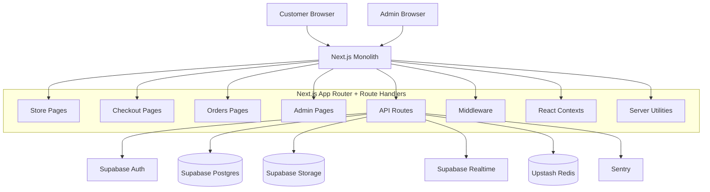
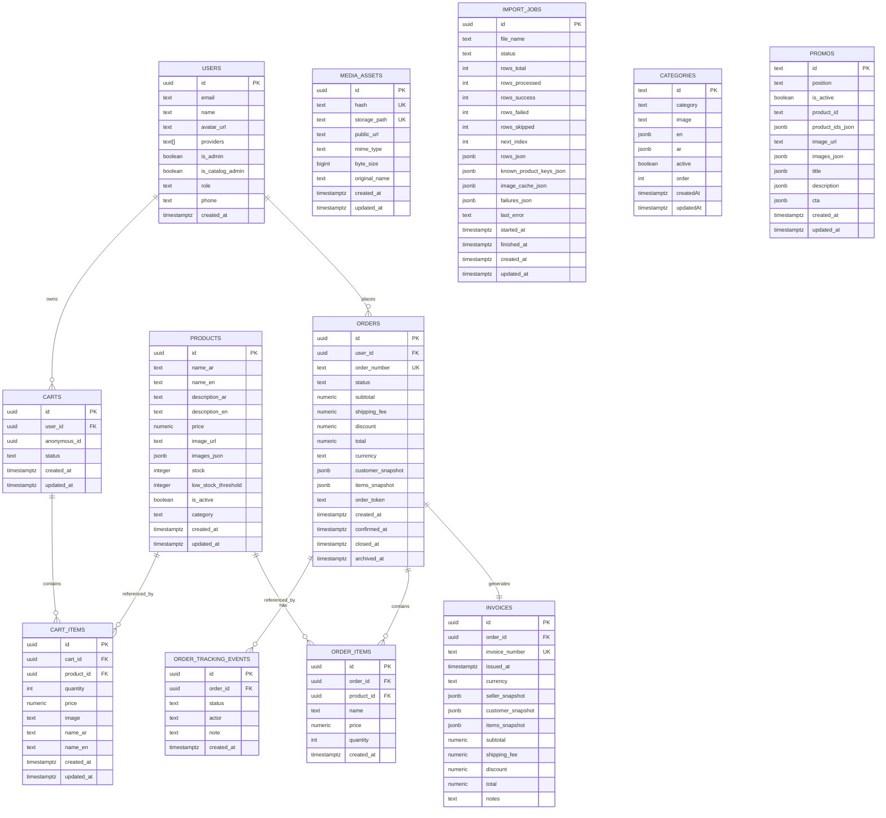
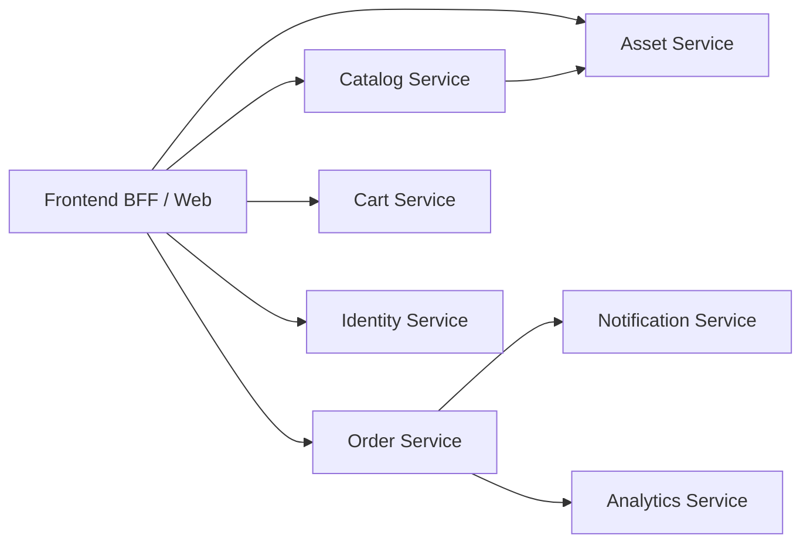
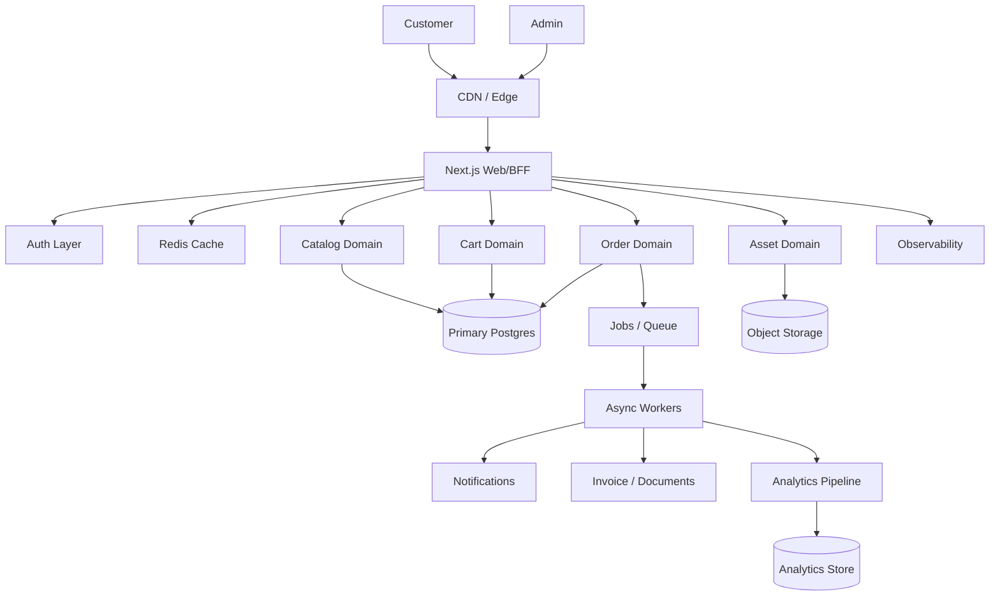

# Cesar Store Comprehensive Project Document

تاريخ الوثيقة: `2026-05-08`
حالة الفحص: تم تحليل المشروع محلياً من ملفات الكود الفعلية داخل المستودع.
نطاق الفحص: `app/`, `components/`, `context/`, `lib/`, `supabase/`, `types/`, `scripts/`, وملفات الجذر المحورية.

## 1. الهدف من الوثيقة

هذه الوثيقة هي المرجع التنفيذي والمعماري الشامل للمشروع، والغرض منها:

- حفظ الفهم الكامل للمشروع بحيث يمكن بدء شات جديد دون فقدان المنطق.
- شرح البنية الحالية كما هي فعلاً في الكود، وليس كما يفترض أن تكون فقط.
- توضيح الفجوات بين التنفيذ الحالي وبين المستوى المطلوب للوصول إلى منصة تنافس `Amazon`, `Shopify`, و`Noon`.
- تقديم ERD بصري، System Design، System Flows، وتقسيم خدمات مستقبلي.
- وضع خطة تطوير، اختبار، تحسين أداء، وخطة scaling نحو `1M users`.

## 2. الملخص التنفيذي

`Cesar Store` هو متجر إلكتروني مبني حالياً كـ `Next.js monolith` باستخدام `App Router`، ويعتمد على:

- `Next.js 14.2.5`
- `React 18`
- `TypeScript`
- `Supabase` كطبقة `Auth + Postgres + Storage + Realtime`
- `Upstash Redis` من أجل `rate limiting` وبعض منطق جلسات الإدارة
- `Sentry` للمراقبة وتتبع الأخطاء
- `@react-pdf/renderer` لتوليد الفواتير PDF
- `xlsx` من أجل استيراد بيانات المنتجات

المشروع ليس `microservices architecture` حالياً، بل تطبيق واحد يحتوي عدة نطاقات وظيفية:

- Storefront
- Checkout
- Customer Orders & Tracking
- Admin Dashboard
- Product Import & Media Management
- Analytics

المشروع يعمل فعلياً وفيه قيمة تشغيلية حقيقية، لكنه لا يزال في مرحلة:

`functional production-capable monolith`

وليس بعد في مرحلة:

`enterprise-grade commerce platform`

## 3. ما الذي تم التحقق منه فعلياً

تمت مراجعة:

- هيكل الملفات الكامل المهم مع استبعاد `node_modules` و`.next`.
- صفحات المتجر والشراء والطلبات.
- Route Handlers الخاصة بالمنتجات والسلة والطلبات والفواتير والعروض والرفع.
- طبقة الإدارة، التتبّع، التحليلات، والاستيراد.
- ملفات `Supabase SQL migrations` والملفات التصميمية التحليلية.
- أدوات البنية مثل `middleware`, `Sentry`, `Redis`, و`Supabase clients`.

تم تنفيذ:

- `npm run lint`: نجح مع `17 warnings` فقط.

لم يكتمل:

- `npm run build`: بدأ التنفيذ ثم استغرق وقتاً طويلاً وتم إيقافه يدوياً، لذلك حالة الـ build النهائية غير مؤكدة في هذا الفحص.

## 4. الحالة الفعلية للمشروع

### 4.1 ما يعمل الآن

- استعراض المنتجات والأقسام والصفحة الرئيسية.
- صفحة متجر مع بحث/فلترة/ترتيب/عروض جانبية.
- صفحة منتج مفرد.
- سلة محلية مع مزامنة اختيارية مع قاعدة البيانات للمستخدم المسجل.
- تسجيل دخول العميل عبر `Supabase Auth` و`Google OAuth`.
- Checkout متعدد المراحل.
- إنشاء الطلب عبر API مع `order_token` وRPC ذري على قاعدة البيانات.
- تتبع الطلبات وعرض حالة الطلب زمنيًا.
- توليد فاتورة JSON وPDF.
- لوحة إدارة للمنتجات، الأقسام، الطلبات، التحليلات، والعروض.
- استيراد منتجات bulk import مع jobs وحفظ صور deduplicated.
- رفع الصور محلياً أو من URL خارجي آمن نسبياً.
- Sentry monitoring.
- Realtime subscriptions لبعض الجداول.

### 4.2 ما هو مخطط له أو ظاهر كتصميم فقط

- `order_versions` كطبقة immutable versions للطلبات والتحليلات المالية.
- معمارية `microservices` حقيقية.
- `search engine` حقيقي.
- Queue/worker architecture للنطاقات الثقيلة.
- طبقة notifications مستقلة.
- Test suite مكتملة.
- تماسك كامل بين schema الفعلية وملفات migrations.

## 5. التقييم الهندسي الصريح

### 5.1 نقاط القوة

- اختيار تقني مناسب كبداية سريعة وقابلة للتوسع المبدئي.
- App Router + API Routes + Supabase يعطي سرعة تنفيذ جيدة.
- فصل جيد نسبياً بين واجهة العميل والإدارة.
- وجود طبقات `lib/services`, `lib/server`, و`lib/auth`.
- يوجد اهتمام فعلي بالـ observability عبر Sentry.
- يوجد وعي بالأداء والأمان مثل rate limiting وadmin session signing.
- منطق إدارة وسائط قوي نسبياً باستخدام hash deduplication.
- وجود import jobs أفضل من الاستيراد المباشر المتزامن للملفات الكبيرة.
- منطق مهم للمخزون عند إلغاء الطلب وإرجاع الكميات.
- استخدام RPC ذري لإنشاء الطلب من أفضل الأجزاء المعمارية الحالية.

### 5.2 نقاط الضعف الحرجة

- يوجد `schema drift` واضح بين الكود، قاعدة البيانات الفعلية، وملفات الهجرات.
- يوجد خلط بين `client state` و`database state` في السلة والطلبات والتتبع.
- هناك مسارات API حساسة لا تطبق نفس مستوى الحماية باستمرار.
- يوجد أكثر من نموذج Auth داخل النظام:
  - Supabase Auth للعملاء
  - Custom admin auth للإدارة
  - وفي بعض المسارات يوجد مزج بينهما
- بعض الملفات تحمل طابع "نسخة قديمة/انتقالية" والخطر هنا هو تضارب المنطق.
- الاعتماد على `service role key` واسع داخل Route Handlers.
- جزء من analytics مبني على جدول `order_versions` التصميمي غير المنفذ.
- أغلب الواجهات تعتمد على `client-side fetch` بدلاً من SSR/streaming/caching.
- لا توجد اختبارات آلية جاهزة ضمن `package.json`.
- الـ lint نظيف نسبياً لكن ما زالت هناك تحذيرات مرتبطة بالأداء والـ hooks.

### 5.3 حكم مهني مختصر

المشروع قوي كبداية تجارية فعلية لمتجر متوسط، لكنه يحتاج إعادة ضبط معمارية مدروسة قبل محاولة التوسع الكبير أو الإعلان عنه كمنصة عالية الاعتمادية.

## 6. المكدس التقني

### Frontend

- `Next.js App Router`
- `React`
- `TypeScript`
- `Tailwind CSS`
- `lucide-react`
- `react-hot-toast`
- `swiper`

### Backend داخل نفس التطبيق

- `Next.js Route Handlers`
- `@supabase/supabase-js`
- `@supabase/ssr`
- `@upstash/redis`
- `@react-pdf/renderer`
- `xlsx`

### Infra / Ops

- `Supabase Postgres`
- `Supabase Storage`
- `Supabase Realtime`
- `Upstash Redis`
- `Sentry`

## 7. شجرة الملفات الفعلية المهمة

### 7.1 إحصاءات أعلى المستودع

- `app`: 67 ملف
- `components`: 12 ملف
- `context`: 5 ملفات
- `hooks`: 1 ملف
- `lib`: 22 ملف
- `scripts`: 1 ملف
- `supabase`: 17 ملف
- `types`: 3 ملفات
- `public`: 683 ملف
- `data-store`: 3 ملفات

### 7.2 الشجرة المنطقية المختصرة

```text
cesar-store/
├─ app/
│  ├─ page.tsx
│  ├─ layout.tsx
│  ├─ globals.css
│  ├─ global-error.tsx
│  ├─ shop/page.tsx
│  ├─ categories/page.tsx
│  ├─ product/[id]/page.tsx
│  ├─ cart/page.tsx
│  ├─ orders/page.tsx
│  ├─ orders/[id]/page.tsx
│  ├─ auth/
│  │  ├─ login/page.tsx
│  │  ├─ register/page.tsx
│  │  ├─ callback/route.ts
│  │  └─ sync/
│  ├─ (checkout)/
│  │  ├─ layout.tsx
│  │  ├─ checkout/page.tsx
│  │  ├─ review/page.tsx
│  │  └─ confirm/
│  ├─ admin/
│  │  ├─ layout.tsx
│  │  ├─ page.tsx
│  │  ├─ analytics/page.tsx
│  │  ├─ charts/page.tsx
│  │  ├─ errors/page.tsx
│  │  ├─ promos/page.tsx
│  │  ├─ categories/
│  │  ├─ products/
│  │  └─ orders/
│  ├─ admin-login/page.tsx
│  └─ api/
│     ├─ products/
│     ├─ categories/
│     ├─ promos/
│     ├─ cart/
│     ├─ orders/
│     ├─ invoice/
│     ├─ invoice-pdf/
│     ├─ upload/
│     └─ admin/
│        ├─ login/
│        ├─ logout/
│        ├─ force-logout/
│        ├─ analytics/
│        ├─ errors/
│        ├─ order-tracking/
│        ├─ order-tracking-events/
│        ├─ orders/
│        └─ products/import/
├─ components/
│  ├─ Navbar.tsx
│  ├─ category/CategoryCard.tsx
│  ├─ product/ProductCard.tsx
│  ├─ product/ProductGrid.tsx
│  ├─ promo/ShopSidePromoSlider.tsx
│  ├─ promo/SidePromoCard.tsx
│  ├─ layout/
│  └─ explore/
├─ context/
│  ├─ AuthContext.tsx
│  ├─ CartContext.tsx
│  ├─ CheckoutContext.tsx
│  ├─ LanguageContext.tsx
│  └─ OrderTrackingContext.tsx
├─ lib/
│  ├─ auth/
│  ├─ admin/
│  ├─ infra/
│  ├─ server/
│  ├─ services/
│  ├─ supabase/
│  ├─ rateLimit.ts
│  ├─ redis.ts
│  ├─ image-normalizer.ts
│  ├─ image-safe.ts
│  ├─ category-normalizer.ts
│  └─ filters.ts
├─ supabase/
│  ├─ migrations/
│  ├─ analytics/
│  ├─ design/
│  └─ config.toml
├─ scripts/
│  └─ cleanup-storage.ts
├─ types/
│  ├─ product.ts
│  ├─ promo.ts
│  └─ product-import.ts
├─ data-store/
│  ├─ products.json
│  ├─ categories.json
│  └─ promos.json
└─ public/
   ├─ products/
   ├─ uploads/
   ├─ slides/
   ├─ fonts/
   └─ branding assets
```

### 7.3 معنى كل طبقة

- `app/`: الواجهات ونقاط الدخول وواجهات API.
- `components/`: المكوّنات المرئية.
- `context/`: حالة العميل المحلية.
- `lib/services/`: منطق أعمال قديم/مساعد لبعض العمليات.
- `lib/server/`: منطق back-office مثل media assets وimport jobs.
- `lib/supabase/`: clients مخصصة للمتصفح والخادم والخدمة.
- `supabase/migrations/`: جزء من schema الرسمي، لكنه لا يغطي كل الواقع.
- `data-store/`: آثار بيانات قديمة/مساندة، وليست المصدر الأساسي الحالي.

## 8. المعمارية الحالية



### 8.1 الحكم المعماري

هذه معمارية Monolith جيدة كبداية، لكنها الآن بدأت تحمل أكثر من مسؤولية:

- Commerce
- Admin back office
- Analytics
- Media ingestion
- Document generation
- Security/session management

وهذا يعني أن المرحلة القادمة يجب أن تكون `modular monolith hardening` ثم فصل بعض النطاقات لاحقاً إلى خدمات مستقلة.

## 9. طبقات العمل الوظيفية

### 9.1 طبقة العميل Storefront

- الصفحة الرئيسية `app/page.tsx`
- صفحة المتجر `app/shop/page.tsx`
- صفحة المنتج `app/product/[id]/page.tsx`
- صفحة الأقسام `app/categories/page.tsx`
- السلة `app/cart/page.tsx`

### 9.2 طبقة الهوية

- `context/AuthContext.tsx`
- `app/auth/callback/route.ts`
- `lib/supabase/client.ts`
- `lib/supabase/server.ts`
- `lib/auth/resolveRequestUser.ts`

### 9.3 طبقة الشراء Checkout

- `context/CheckoutContext.tsx`
- `app/(checkout)/checkout/page.tsx`
- `app/(checkout)/review/page.tsx`
- `app/(checkout)/confirm/*`

### 9.4 طبقة الطلبات

- `app/api/orders/route.ts`
- `app/api/orders/[id]/route.ts`
- `app/orders/page.tsx`
- `app/orders/[id]/page.tsx`
- `app/api/invoice/*`
- `app/api/invoice-pdf/*`

### 9.5 طبقة الإدارة

- `middleware.ts`
- `lib/admin/*`
- `app/admin/*`
- `app/api/admin/*`

### 9.6 طبقة الوسائط والاستيراد

- `app/api/upload/route.ts`
- `lib/server/media-assets.ts`
- `app/api/admin/products/import/*`
- `lib/server/product-import.ts`

## 10. قاعدة البيانات الحالية

## 10.1 الجداول المؤكدة من الكود/الـ schema السياقي

- `products`
- `categories`
- `promos`
- `carts`
- `cart_items`
- `orders`
- `order_items`
- `order_tracking_events`
- `invoices`
- `users`
- `media_assets`
- `import_jobs`
- `admin_audit_logs` مستخدم في الكود ويفترض وجوده

## 10.2 الجداول/المفاهيم التصميمية غير المنفذة بالكامل

- `order_versions`

## 10.3 مشكلة مهمة: Schema Drift

ملفات migrations في `supabase/migrations` لا تمثل كل ما يعتمد عليه التطبيق الفعلي. أمثلة واضحة:

- `orders` في الـ migration الأساسية لا تحتوي بعض الأعمدة التي يعتمد عليها الكود أو schema context مثل:
  - `status`
  - `confirmed_at`
  - `closed_at`
  - `order_token`
  - `archived_at`
- `products` فعلياً يعتمد عليها الكود بخصائص إضافية مثل:
  - `images_json`
  - `low_stock_threshold`
- `promos` تم تمديدها تدريجياً وتستعمل:
  - `image_url`
  - `images_json`
  - `product_ids_json`

هذه الفجوة من أخطر ما في المشروع حالياً.

## 11. ERD الفعلي



## 12. ERD التفسيري

### 12.1 المسار التجاري

- المستخدم يمتلك سلة نشطة `carts`.
- السلة تحتوي `cart_items` بنسخة snapshot للسعر والاسم والصورة.
- عند إنشاء الطلب، يتحول المحتوى إلى:
  - `orders.items_snapshot`
  - وربما `order_items`
- حالة الطلب لا تعتمد فقط على عمود `orders.status` بل أيضاً على `order_tracking_events`.

### 12.2 المسار الإعلامي

- الصور لا تحفظ فقط كروابط خام، بل توجد طبقة `media_assets` لتجنب التكرار وإدارة storage paths.

### 12.3 مسار الاستيراد

- استيراد المنتجات يتم عبر `import_jobs` كـ state machine بسيطة:
  - `pending`
  - `processing`
  - `completed`
  - `failed`

## 13. System Flows

## 13.1 تدفق الشراء من التصفح حتى إنشاء الطلب

```mermaid
flowchart LR
    U[User] --> HP[Home / Shop / Product]
    HP --> CART[CartContext + localStorage]
    CART -->|logged user| API_CART[/api/cart + /api/cart/items]
    CART --> CHECKOUT[Checkout Page]
    CHECKOUT --> REVIEW[Review Page]
    REVIEW --> API_ORDER[/api/orders]
    API_ORDER --> RPC[Supabase RPC create_order_atomic]
    RPC --> DB[(Orders + Tracking + Stock)]
    REVIEW --> WA[WhatsApp Window]
    API_ORDER --> CONFIRM[Confirm Page]
```

## 13.2 تدفق إدارة الطلب

```mermaid
flowchart TD
    Admin[Admin UI] --> AO[/api/admin/orders]
    Admin --> AT[/api/admin/order-tracking]
    AT --> OTE[(order_tracking_events)]
    AT --> ORD[(orders)]
    AT --> PROD[(products stock)]
    OTE --> CustomerRealtime[Customer order tracking page via Realtime]
```

## 13.3 تدفق رفع الصور

```mermaid
flowchart TD
    Source[File or image_url] --> UploadAPI[/api/upload]
    UploadAPI --> Resolver[lib/server/media-assets.ts]
    Resolver --> Hash[MD5 Hash]
    Hash --> Exists{media_assets hash exists?}
    Exists -->|Yes| Reuse[Return existing public_url]
    Exists -->|No| Storage[(Supabase Storage bucket upload)]
    Storage --> Assets[(media_assets table)]
```

## 13.4 تدفق استيراد المنتجات

```mermaid
flowchart TD
    Excel[Excel rows] --> ImportAPI[/api/admin/products/import]
    ImportAPI --> Job[Create import_jobs row]
    AdminPoll[Admin polls job] --> JobAPI[/api/admin/products/import/[jobId]]
    JobAPI --> Processor[processProductImportJob]
    Processor --> Validate[Normalize and validate rows]
    Validate --> ResolveImages[Upload/deduplicate images]
    ResolveImages --> InsertProducts[(products)]
    Processor --> UpdateJob[(import_jobs)]
```

## 14. التقسيم الحالي إلى Domains

### Domain 1: Catalog

- المنتجات
- الأقسام
- العروض الترويجية
- الصور

### Domain 2: Cart & Checkout

- السلة
- بيانات الشحن
- مراجعة الطلب

### Domain 3: Order Management

- إنشاء الطلب
- tracking events
- الفواتير
- order lifecycle

### Domain 4: Admin Back Office

- login/logout
- order operations
- products management
- promos management
- analytics

### Domain 5: Content & Assets

- uploads
- managed media assets
- import jobs

## 15. Microservices Breakdown المقترح

هذا ليس ما هو مطبق الآن، بل الهدف المستقبلي المنطقي.



### 15.1 التقسيم الأفضل

- `Catalog Service`
  - products
  - categories
  - promos
  - search indexing

- `Cart Service`
  - carts
  - cart_items
  - merge logic

- `Order Service`
  - orders
  - tracking
  - payment state
  - invoices
  - inventory reservation

- `Asset Service`
  - media_assets
  - uploads
  - deduplication
  - image processing

- `Analytics Service`
  - BI
  - dashboards
  - materialized views

- `Notification Service`
  - WhatsApp
  - email
  - SMS
  - admin alerts

## 16. مشكلات الأداء الحالية

### 16.1 Frontend

- استخدام واسع لـ `` بدلاً من `next/image`.
- اعتماد كبير على `client-side fetching`.
- الصفحة الرئيسية والمتجر تسحب البيانات بعد render.
- لا توجد إستراتيجية caching واضحة للكتالوج.
- لا توجد pagination أو infinite loading على الكتالوج العام.

### 16.2 Backend

- كثرة route handlers التي تبني clients وتتعامل مباشرة مع service role.
- بعض المسارات تنفذ عدة queries متتالية يمكن اختصارها أو تجميعها.
- لا توجد queues للأعمال الثقيلة.
- import processing يتم عبر polling ويعتمد على API sync chunks.

### 16.3 Database

- غياب وثيقة schema موحدة قابلة للنشر بثقة.
- التحليلات تبنى runtime عبر queries/joins بدلاً من views/materialized views جاهزة بالكامل.
- لا توجد دلائل واضحة على indexing كامل لكل فلاتر الإدارة والتحليلات.

## 17. خطة Performance Tuning

## المرحلة 1: Quick Wins

- استبدال الصور الحرجة بـ `next/image`.
- تحويل صفحات `shop`, `categories`, `product` إلى server-first rendering حيثما أمكن.
- استخدام `revalidate`/`cache tags` لبيانات المنتجات والأقسام.
- تقليل fetches المتكررة من العميل.
- إضافة pagination للإدارة وللمتجر.

## المرحلة 2: Structural Wins

- بناء `catalog query layer` موحدة.
- استخدام materialized views للتحليلات الثقيلة.
- نقل import processing إلى queue worker.
- نقل invoice generation إلى background/on-demand isolated worker.

## المرحلة 3: Scale Wins

- Search index منفصل.
- CDN strategy للصور.
- read replicas / analytics replica.
- event-driven pipeline للطلبات والتتبع.

## 18. System Design Whiteboard المستهدف



## 19. خطة Scaling إلى 1M Users

## 19.1 ما الذي يجب ألا يحدث

لا يجب محاولة الوصول إلى `1M users` بنفس التكوين الحالي مباشرة، لأن المشروع سيواجه سريعاً:

- تضخم queries
- تضارب state
- بطء في catalog rendering
- ضغط على Supabase مباشرة من الواجهة
- صعوبة tracing للأعطال

## 19.2 الخطة المرحلية

### Phase A: من الآن إلى 10K users

- تثبيت schema رسمي واحد.
- توحيد auth boundaries.
- تفعيل caching للكتالوج.
- كتابة tests أساسية.
- تحسين الصور والـ bundle.
- تنظيف API security gaps.

### Phase B: 10K إلى 100K users

- modular monolith صارم.
- background jobs.
- search service.
- event log للطلبات.
- materialized views للتحليلات.
- edge caching للصفحات العامة.

### Phase C: 100K إلى 1M users

- فصل الخدمات:
  - catalog
  - order
  - notification
  - analytics
- read/write separation
- queue-first architecture
- read replicas
- warehouse / BI
- dedicated observability stack
- SLOs وerror budgets

## 20. المخاطر الرئيسية

### مخاطر تقنية

- drift بين الكود والـ DB.
- تعارض بين localStorage والـ DB state.
- تضارب status sources بين `orders.status` و`order_tracking_events`.
- مسارات إدارة/كتالوج قد تفتقد auth consistent policy.
- عدم اكتمال اختبارات النشر والإنتاج.

### مخاطر أعمال

- stock correctness تحت الضغط.
- duplicate/partial orders.
- analytics غير موثوقة 100% بسبب design-only tables.
- ضعف traceability عند أعطال الإنتاج.

## 21. ملاحظات أمنية مهمة

### ملاحظات مؤكدة من الكود

- `middleware.ts` يحمي `/admin/*` و`/api/admin/*`.
- جلسات الإدارة تعتمد على:
  - cookie موقعة HMAC
  - Redis persistence
- كثير من APIs تعمل بـ `SUPABASE_SERVICE_ROLE_KEY`.
- يوجد rate limiting بعدة أماكن.

### فجوات واضحة

- `app/api/categories/route.ts` لا يفرض admin auth على `POST/PUT/DELETE`.
- `app/api/promos/route.ts` لا يفرض admin auth على `POST/PUT/DELETE`.
- `app/api/admin/force-logout/route.ts` يكتب `admin_session_version` لكن validator الحالي لا يعتمد عليه.
- خلط auth models بين admin custom auth وsupabase auth قد يسبب أخطاء حوكمة.

## 22. ملاحظات جودة الكود

### نتائج lint

أبرز التحذيرات:

- استخدام `` في عدة صفحات ومكونات.
- `useEffect` مع dependencies ناقصة في بعض الصفحات الإدارية وصفحة تتبع الطلب.

### ماذا تعني عملياً

- الأداء البصري وLCP يمكن تحسينه.
- بعض effects قد تعاني stale closures أو إعادة تحميل غير منضبطة.

## 23. خطة الاختبارات المطلوبة

## 23.1 المرحلة القادمة مباشرة

- Unit tests لـ:
  - image normalization
  - category normalization
  - filters
  - order status transition logic
  - inventory restore logic

- Integration tests لـ:
  - `/api/cart/items`
  - `/api/orders`
  - `/api/orders/[id]`
  - `/api/admin/order-tracking`
  - `/api/upload`
  - import jobs

- E2E tests لـ:
  - browse → add to cart → checkout → create order
  - admin login → update order status
  - customer order tracking update
  - invoice generation

## 23.2 أدوات مقترحة

- `Vitest` أو `Jest` للـ unit/integration
- `Playwright` للـ E2E
- Supabase test environment منفصلة

## 24. خارطة التطوير الزمنية

## أول 2 أسبوع

- توحيد schema source of truth
- إغلاق فجوات auth على categories/promos
- تثبيت lifecycle states في مكان واحد
- إضافة tests حرجة للطلبات والمخزون
- استبدال الصور الحرجة بـ `next/image`

## من الأسبوع 3 إلى 6

- refactor السلة والـ checkout لتقليل تضارب local/client/db state
- تحسين catalog fetching وcache strategy
- إنهاء production-grade import pipeline
- تحسين analytics data contracts

## من الأسبوع 7 إلى 12

- queue + worker layer
- notification pipeline
- search
- observability dashboards
- release pipeline وpreview environments

## من 3 إلى 6 أشهر

- modular monolith boundaries
- read models للتحليلات
- partial service extraction
- SEO/performance hardening
- BI/reporting layer

## 25. ما الذي يحتاجه المشروع ليتنافس مع Amazon / Shopify / Noon

### على مستوى المنتج

- بحث قوي
- توصيات
- promo engine متقدم
- إدارة مخزون دقيقة
- تسعير وشحن وضرائب وقسائم متقدمة
- payment integrations متعددة

### على مستوى الهندسة

- event-driven architecture
- resilient order pipeline
- async jobs
- observability ناضجة
- test coverage حقيقية
- data contracts واضحة

### على مستوى التشغيل

- CI/CD صلب
- rollbacks
- incident response
- backups + restore drills
- staging parity

## 26. التوصيات النهائية مرتبة بالأولوية

### أولوية قصوى P0

- توحيد مخطط قاعدة البيانات وإنتاج migrations كاملة مطابقة للواقع.
- تأمين `categories` و`promos` write routes.
- توحيد مصدر الحقيقة لحالة الطلب.
- تغطية إنشاء الطلب والمخزون باختبارات آلية.

### أولوية عالية P1

- تقليل client-side fetching.
- تحسين الصور.
- بناء caching strategy للكتالوج.
- إصلاح تضارب سلة localStorage مع DB.
- إعادة تنظيم auth boundaries.

### أولوية مهمة P2

- queue/workers
- search
- analytics materialization
- notification service
- admin audit hardening

## 27. الخلاصة النهائية

المشروع ليس بسيطاً، بل يحتوي بالفعل على نواة تجارة إلكترونية محترمة تشمل catalog, cart, checkout, orders, admin, invoices, promos, uploads, import jobs, analytics, monitoring.

لكن أهم حقيقة يجب تثبيتها هي:

المشكلة الرئيسية ليست في نقص الميزات فقط، بل في `الصلابة المعمارية` و`توحيد الحقيقة التقنية` بين الكود وقاعدة البيانات والحالة التشغيلية.

إذا تم تنفيذ الخطوات التالية بالترتيب:

1. توحيد schema
2. تأمين boundaries
3. اختبار order pipeline
4. تقوية الأداء والـ caching
5. فصل النطاقات الثقيلة تدريجياً

فالمشروع يمكن أن يتحول من متجر Monolith جيد إلى منصة تجارة قوية قابلة للتوسع الحقيقي.

## 28. الخطوة القادمة المقترحة فوراً

أفضل خطوة عملية تالية ليست إضافة ميزة جديدة، بل تنفيذ:

`Architecture Stabilization Sprint`

ومحتواه:

- schema reconciliation
- security hardening
- order pipeline tests
- performance quick wins
- production readiness checklist

هذا هو الطريق الصحيح قبل أي توسع كبير أو حمل تسويقي أو زيادة حادة في عدد المستخدمين.
