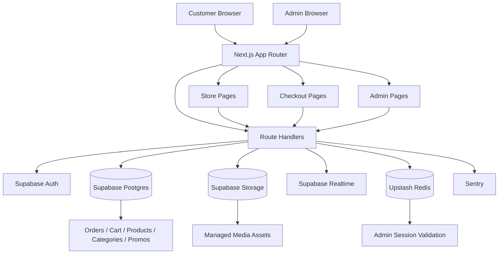
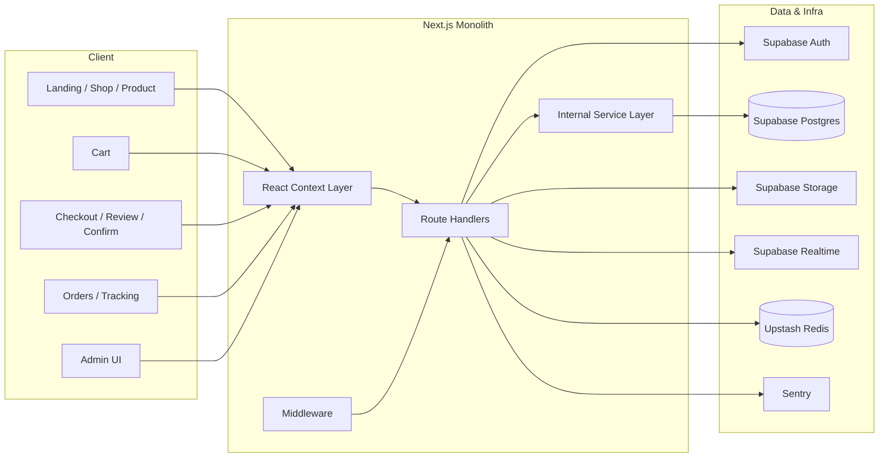
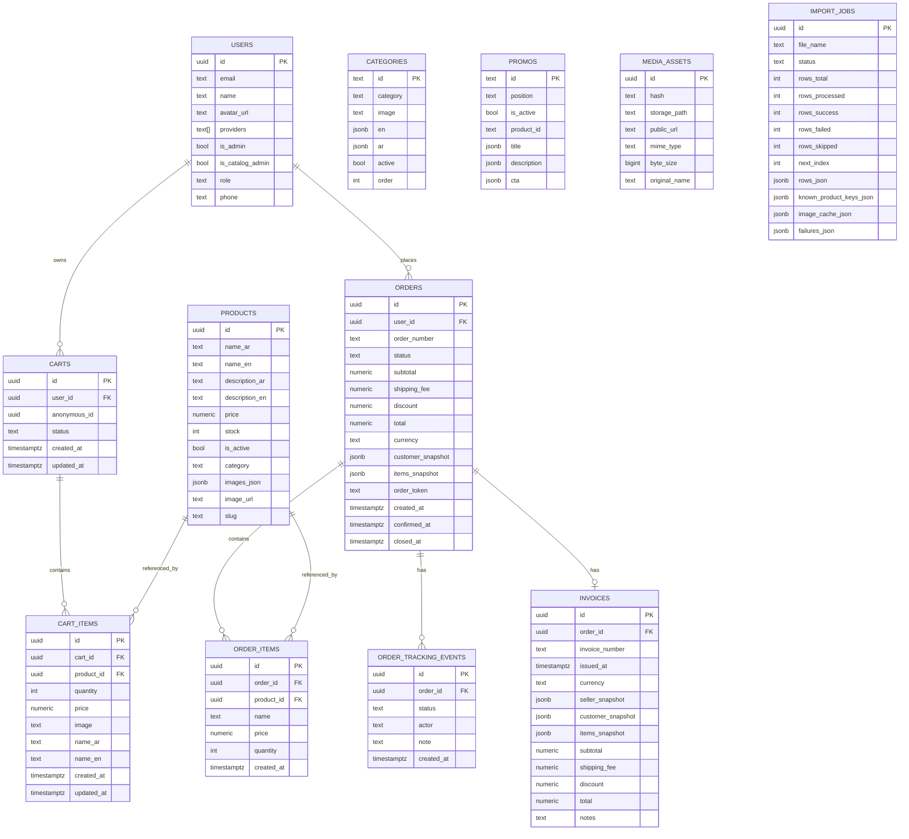
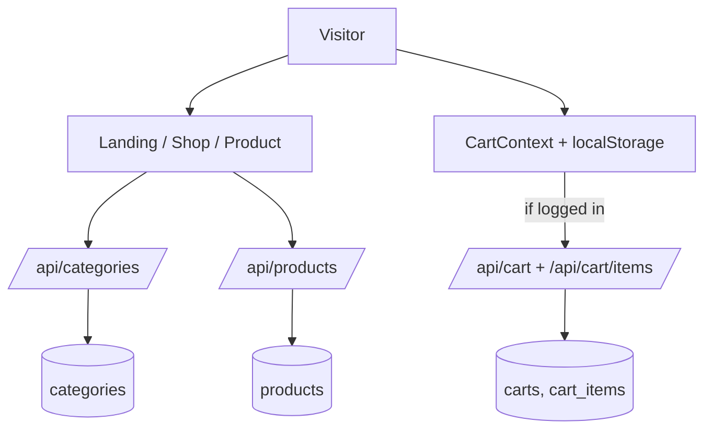
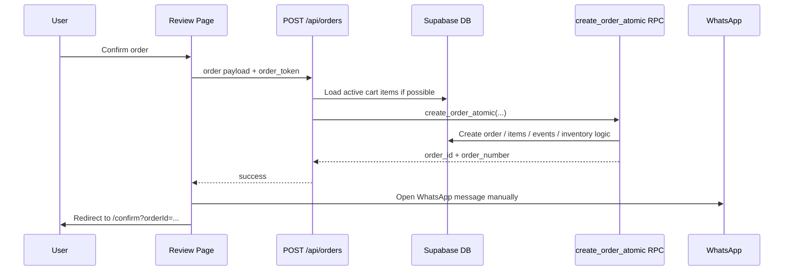
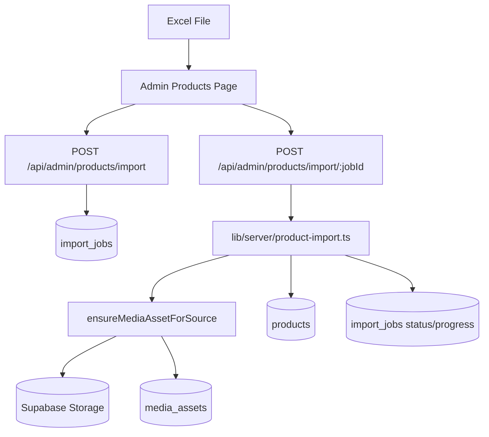
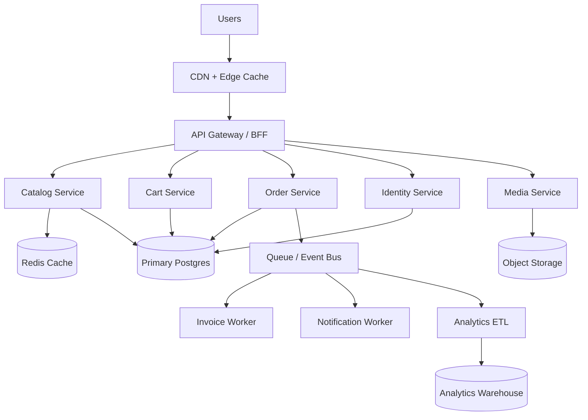

# Cesar Store Master Analysis

تاريخ التوثيق: `2026-05-07`
حالة التحقق: تمت قراءة المشروع محلياً من الملفات الفعلية داخل المستودع، مع تشغيل `npm run lint` بنجاح وظهور تحذيرات فقط. لم يكتمل `npm run build` لأن العملية استغرقت وقتاً طويلاً وتم إيقافها يدوياً أثناء التنفيذ.

## 1. الملخص التنفيذي

`Cesar Store` هو متجر إلكتروني مبني حالياً كـ `Next.js monolith` باستخدام `App Router`، ويعتمد على:

- `Next.js 14.2.5`
- `React 18`
- `TypeScript`
- `Supabase` كطبقة `Auth + Database + Storage + Realtime`
- `Upstash Redis` للجلسات الإدارية والـ rate limiting
- `Sentry` للمراقبة وتتبع الأخطاء

المشروع ليس `Microservices` فعلياً في وضعه الحالي، بل هو تطبيق واحد مع تقسيم منطقي داخلي إلى:

- واجهة متجر العميل
- لوحة تحكم الإدارة
- API routes
- خدمات داخلية `services`
- طبقة مساعدة لـ Supabase وRedis

المتجر يعمل وظيفياً في عدة مسارات أساسية:

- تصفح المنتجات والأقسام
- إضافة إلى السلة
- تسجيل دخول المستخدم
- إتمام الطلب
- استعراض الطلبات
- إصدار فاتورة PDF
- إدارة منتجات وطلبات وتحليلات من لوحة الإدارة
- رفع صور وإدارة import للمنتجات من Excel

لكن توجد فجوات معمارية وتنفيذية مهمة يجب اعتبارها جزءاً من "الحالة الحقيقية الحالية":

- يوجد `schema drift` واضح بين الكود وبين الهجرات الموجودة داخل `supabase/migrations`
- بعض خصائص النظام موجودة في الكود فقط، وليست موثقة أو مضمونة في الهجرات
- توجد ازدواجية بين الحالة المحلية `localStorage` وحالة قاعدة البيانات في أكثر من مكان
- توجد طبقة إدارة تعتمد على `custom admin auth` منفصلة عن `Supabase Auth`، ومع ذلك بعض المسارات تمزج بين النظامين
- توجد أجزاء "مصممة هندسياً" لكن غير منفذة بالكامل، مثل `order_versions`

هذه الوثيقة تشرح الوضع الحالي كما هو، وتفصل بين:

1. ما هو موجود فعلاً ويعمل الآن
2. ما هو مخطط له أو مفترض معمارياً
3. ما يحتاجه المشروع ليصل إلى مستوى منافسة منصات كبيرة مثل `Amazon / Shopify / Noon`

## 2. What Exists Now vs What Is Planned

### الموجود فعلياً الآن

- `Monolithic Next.js app`
- Storefront pages
- Admin dashboard pages
- Customer auth عبر Supabase
- Admin auth عبر cookie موقعة + Redis
- Cart APIs
- Order creation API
- Order tracking events
- Invoice JSON + PDF routes
- Product import jobs
- Media deduplication عبر hashing
- Sentry instrumentation
- Realtime subscriptions لبعض الجداول

### الموجود كتصميم أو intent فقط

- `order_versions` كطبقة تحليل مالي وإصدارات للطلبات
- Microservices architecture
- Full-scale 1M-users architecture
- Mature testing strategy
- Complete DB migration parity with application code
- Queue-based asynchronous workflows
- Search engine حقيقي
- Dedicated notification service

## 3. التقييم العام للحالة الحالية

### نقاط القوة

- المشروع منظم منطقياً أكثر من كونه عشوائياً
- تم فصل مسارات المتجر عن لوحة الإدارة بوضوح
- توجد طبقة خدمات للطلب والسلة
- توجد محاولات جيدة لتأمين الإدارة عبر Redis sessions وHMAC-signed cookies
- يوجد دعم Realtime من Supabase
- يوجد مسار واضح لاستيراد المنتجات بكميات كبيرة
- يوجد توليد فواتير PDF
- يوجد Rate limiting على عدة APIs حساسة

### نقاط الضعف الحرجة

- الهجرات الحالية لا تمثل كل ما يعتمد عليه التطبيق فعلياً
- بعض APIs الإدارية غير محمية بنفس الصرامة
- توجد حالات اعتماد على `service role key` مباشرة داخل APIs كثيرة
- واجهة العميل تعتمد بدرجة عالية على `client-side fetching`
- الأداء سيهبط مع زيادة البيانات لأن كثيراً من الصفحات لا تستفيد من cache أو SSR محسوب
- السلة والطلب والتتبع فيها طبقات محلية قد تسبب التباساً في المصدر الحقيقي للبيانات
- لا توجد suite اختبارات تلقائية فعلية
- لا يوجد `tests` script في `package.json`

### جاهزية الإنتاج الحالية

الحالة الحالية يمكن وصفها بأنها:

- `Functional production-capable prototype`
- وليست بعد `enterprise-grade production platform`

بمعنى:

- يمكنها خدمة متجر فعلي صغير إلى متوسط
- لكنها تحتاج hardening واضح قبل التوسع الكبير أو حمل المستخدمين العالي

## 4. المكدس التقني

### Frontend

- `Next.js App Router`
- `React`
- `Tailwind CSS`
- `lucide-react`
- `react-hot-toast`
- `swiper`

### Backend داخل نفس التطبيق

- `Next.js Route Handlers`
- `@supabase/supabase-js`
- `@supabase/ssr`
- `@upstash/redis`
- `@react-pdf/renderer`
- `xlsx`

### المراقبة والتشغيل

- `Sentry`
- `Redis rate limiting`
- `Supabase Realtime`

### ملاحظات مهمة

- لا يوجد `Prisma`
- لا يوجد `ORM` تقليدي
- لا يوجد message broker
- لا يوجد queue runner منفصل
- لا يوجد worker process مستقل

## 5. التصميم المعماري الحالي



## 6. System Design Whiteboard



## 7. شجرة الملفات الحقيقية للمشروع

مهم: الشجرة التالية تمثل البنية المهمة فعلياً للمشروع. تم استبعاد:

- `node_modules`
- `.next`
- التفاصيل الطويلة لكل ملف صورة فردي داخل `public`

لأنها artifacts أو أصول ضخمة متكررة لا تضيف قيمة معمارية، مع الإبقاء على كل المجلدات والملفات المصدرية الجوهرية.

### Top-level inventory

- `app/` : 67 ملفاً
- `components/` : 11 ملفاً
- `context/` : 5 ملفات
- `hooks/` : 1 ملف
- `lib/` : 22 ملفاً
- `scripts/` : 1 ملف
- `supabase/` : 15 ملفاً
- `types/` : 2 ملفان
- `public/` : 419 ملفاً متتبعاً
- `data-store/` : 3 ملفات
- ملفات root المساندة: `package.json`, `next.config.js`, `middleware.ts`, `instrumentation*.ts`, `sentry*.ts`, وثائق ونماذج بيانات

### Source tree

```text
cesar-store/
├─ app/
│  ├─ layout.tsx
│  ├─ page.tsx
│  ├─ globals.css
│  ├─ global-error.tsx
│  ├─ (checkout)/
│  │  ├─ layout.tsx
│  │  ├─ checkout/page.tsx
│  │  ├─ review/page.tsx
│  │  └─ confirm/
│  │     ├─ page.tsx
│  │     └─ ConfirmClient.tsx
│  ├─ admin/
│  │  ├─ layout.tsx
│  │  ├─ AdminClientLayout.tsx
│  │  ├─ page.tsx
│  │  ├─ analytics/page.tsx
│  │  ├─ charts/page.tsx
│  │  ├─ errors/page.tsx
│  │  ├─ orders/
│  │  │  ├─ page.tsx
│  │  │  ├─ archive/page.tsx
│  │  │  └─ [id]/page.tsx
│  │  ├─ products/
│  │  │  ├─ page.tsx
│  │  │  ├─ add/page.tsx
│  │  │  └─ edit/[id]/page.tsx
│  │  ├─ categories/
│  │  │  ├─ page.tsx
│  │  │  ├─ add/page.tsx
│  │  │  └─ edit/[id]/page.tsx
│  │  └─ promos/page.tsx
│  ├─ admin-login/page.tsx
│  ├─ auth/
│  │  ├─ callback/route.ts
│  │  ├─ login/page.tsx
│  │  ├─ register/page.tsx
│  │  └─ sync/
│  │     ├─ page.tsx
│  │     └─ sync-content.tsx
│  ├─ cart/page.tsx
│  ├─ categories/page.tsx
│  ├─ orders/
│  │  ├─ page.tsx
│  │  └─ [id]/page.tsx
│  ├─ product/[id]/page.tsx
│  ├─ shop/page.tsx
│  ├─ sentry-example-page/page.tsx
│  └─ api/
│     ├─ products/
│     │  ├─ route.ts
│     │  └─ [id]/route.ts
│     ├─ categories/route.ts
│     ├─ promos/route.ts
│     ├─ upload/route.ts
│     ├─ cart/
│     │  ├─ route.ts
│     │  ├─ items/route.ts
│     │  └─ merge/route.ts
│     ├─ orders/
│     │  ├─ route.ts
│     │  └─ [id]/route.ts
│     ├─ invoice/
│     │  └─ [orderId]/
│     │     ├─ route.ts
│     │     └─ pdf/route.ts
│     ├─ invoice-pdf/[orderId]/route.ts
│     ├─ sentry-example-api/route.ts
│     └─ admin/
│        ├─ login/route.ts
│        ├─ logout/route.ts
│        ├─ force-logout/route.ts
│        ├─ errors/route.ts
│        ├─ analytics/
│        │  ├─ route.ts
│        │  └─ reset/route.ts
│        ├─ orders/
│        │  ├─ route.ts
│        │  ├─ delete/route.ts
│        │  ├─ hard-delete/route.ts
│        │  ├─ restore/route.ts
│        │  └─ [orderId]/route.ts
│        ├─ order-tracking/route.ts
│        ├─ order-tracking-events/route.ts
│        └─ products/import/
│           ├─ route.ts
│           └─ [jobId]/route.ts
├─ components/
│  ├─ Navbar.tsx
│  ├─ category/CategoryCard.tsx
│  ├─ explore/
│  │  ├─ ExploreCategories.tsx
│  │  ├─ ExploreGallery.tsx
│  │  ├─ ExploreHero.tsx
│  │  └─ ExploreUseCases.tsx
│  ├─ layout/
│  │  ├─ Navbar.tsx
│  │  └─ Footer.tsx
│  ├─ product/
│  │  ├─ ProductCard.tsx
│  │  └─ ProductGrid.tsx
│  └─ promo/SidePromoCard.tsx
├─ context/
│  ├─ AuthContext.tsx
│  ├─ CartContext.tsx
│  ├─ CheckoutContext.tsx
│  ├─ LanguageContext.tsx
│  └─ OrderTrackingContext.tsx
├─ hooks/
│  └─ useRequireAuth.ts
├─ lib/
│  ├─ admin/
│  │  ├─ adminSessionStore.ts
│  │  ├─ constants.ts
│  │  ├─ session-core.ts
│  │  └─ validateAdminSession.ts
│  ├─ auth/
│  │  ├─ requireAdminAccess.ts
│  │  └─ resolveRequestUser.ts
│  ├─ infra/redis.ts
│  ├─ server/
│  │  ├─ media-assets.ts
│  │  └─ product-import.ts
│  ├─ services/
│  │  ├─ cartService.ts
│  │  └─ orderService.ts
│  ├─ supabase/
│  │  ├─ client.ts
│  │  ├─ runtime.ts
│  │  └─ server.ts
│  ├─ category-normalizer.ts
│  ├─ filters.ts
│  ├─ formatCurrency.ts
│  ├─ image-normalizer.ts
│  ├─ image-safe.ts
│  ├─ rateLimit.ts
│  ├─ redis.ts
│  └─ supabaseClient.ts
├─ data-store/
│  ├─ products.json
│  ├─ categories.json
│  └─ promos.json
├─ scripts/
│  └─ cleanup-storage.ts
├─ supabase/
│  ├─ config.toml
│  ├─ analytics/analytics_aggregations.sql
│  ├─ design/order_versions.design.sql
│  └─ migrations/
│     ├─ 2026030101_create_orders_clean.sql
│     ├─ 2026030102_create_order_tracking_events_clean.sql
│     ├─ 2026030103_create_invoices_clean.sql
│     └─ 2026042801_create_media_assets_and_import_jobs.sql
├─ types/
│  ├─ product.ts
│  └─ product-import.ts
├─ middleware.ts
├─ instrumentation.ts
├─ instrumentation-client.ts
├─ next.config.js
├─ package.json
└─ sentry.server.config.ts / sentry.edge.config.ts
```

### Public assets inventory

- `public/products/` : 208 ملفاً
- `public/fonts/` : 99 ملفاً
- `public/uploads/` : 74 ملفاً أو أكثر بحسب التتبع الحالي
- `public/categories/` : 35 ملفاً
- `public/backup photos/` : 22 ملفاً
- `public/slides/` : 14 ملفاً

ملاحظة تشغيلية:

- يوجد تكرار واضح في الصور المحلية بين `public/products`, `public/uploads`, `public/categories`, `public/backup photos`
- هناك فرصة قوية لتقليل الحجم والتكرار عبر توحيد استراتيجية التخزين

## 8. تحليل الوحدات الوظيفية

### 8.1 Storefront

الملفات الرئيسية:

- `app/page.tsx`
- `app/shop/page.tsx`
- `app/product/[id]/page.tsx`
- `components/Navbar.tsx`
- `components/product/*`

السلوك:

- الصفحة الرئيسية تعرض hero slider + categories fetch من `/api/categories`
- صفحة المتجر تحمل المنتجات والأقسام من العميل ثم تطبق filtering/sorting محلياً
- صفحة المنتج لا تستخدم `/api/products/[id]` مباشرة، بل تجلب القائمة كاملة ثم تبحث عن المنتج محلياً

النتيجة:

- مناسب لحجم بيانات صغير
- غير مناسب عند تضخم الكتالوج

### 8.2 Customer Authentication

الملفات الرئيسية:

- `context/AuthContext.tsx`
- `app/auth/callback/route.ts`
- `app/auth/login/page.tsx`
- `app/auth/sync/*`
- `lib/supabase/client.ts`
- `lib/supabase/server.ts`

المنهج:

- المستخدم العادي يعتمد على Supabase Auth
- يوجد Email/Password + Google + Apple
- بعد OAuth يحصل redirect إلى `callback` ثم `sync`

ملاحظات:

- مسار OAuth تم التعامل معه عملياً، لكنه متعدد الطبقات أكثر من اللازم
- يوجد تخزين redirect paths داخل `sessionStorage`

### 8.3 Admin Authentication

الملفات الرئيسية:

- `app/api/admin/login/route.ts`
- `app/api/admin/logout/route.ts`
- `middleware.ts`
- `lib/admin/*`
- `lib/infra/redis.ts`

التصميم الحالي:

- Admin login مستقل عن Supabase Auth
- يتم إنشاء token عشوائي
- يتم توقيع token باستخدام HMAC SHA256
- يتم تخزين token داخل Redis
- يتم وضع cookie اسمها `cesar_admin_session`

المصدر الحقيقي للتحقق:

- `lib/admin/validateAdminSession.ts`

مشكلة مهمة جداً:

- `middleware.ts` يتحقق من صحة التوقيع فقط
- `validateAdminSession()` يتحقق من التوقيع + وجود session في Redis
- بعض الطبقات تخلط بين التحققين

مشكلة أخطر:

- `app/api/admin/force-logout/route.ts` يكتب `admin_session_version` داخل Redis
- لكن `validateAdminSession()` لا تقرأ هذا المفتاح
- و`middleware.ts` أيضاً لا يقرأ version من Redis
- إذن `force logout all sessions` ليس مضمون الفاعلية فعلياً كما يوحي الاسم

### 8.4 Cart System

الملفات الرئيسية:

- `context/CartContext.tsx`
- `app/api/cart/route.ts`
- `app/api/cart/items/route.ts`
- `app/api/cart/merge/route.ts`
- `lib/services/cartService.ts`

الوضع الحالي:

- السلة تعتمد على `localStorage` للمستخدم غير المسجل
- بعد تسجيل الدخول يحدث merge إلى DB
- العميل يحدث UI محلياً ثم يحاول sync مع الخادم

المزايا:

- UX جيد للمستخدم غير المسجل
- استمرار البيانات محلياً

المخاطر:

- مصدر الحقيقة ليس دائماً واضحاً
- توجد احتمالات race conditions بين local state وDB state
- يتم حفظ snapshot لبعض بيانات المنتج في `cart_items`

### 8.5 Checkout + Order Creation

الملفات الرئيسية:

- `context/CheckoutContext.tsx`
- `app/(checkout)/checkout/page.tsx`
- `app/(checkout)/review/page.tsx`
- `app/api/orders/route.ts`
- `app/api/orders/[id]/route.ts`
- `lib/services/orderService.ts`

الملاحظات:

- هناك مساران لإنشاء الطلب:
  - `CheckoutContext.submitOrder()` عبر `orderService.createOrder()`
  - صفحة `review/page.tsx` عبر `/api/orders`
- المسار المعتمد فعلياً في واجهة المستخدم هو API route
- API route تعتمد على RPC اسمها `create_order_atomic`

مشكلة حرجة:

- لا يوجد تعريف لهذه الـ RPC داخل الهجرات الموجودة في المستودع
- بالتالي نجاح الطلب يعتمد على database state خارج ما هو موثق في repo

هذه من أهم النقاط التي يجب عدم نسيانها في أي تطوير لاحق.

### 8.6 Orders & Tracking

الملفات الرئيسية:

- `app/orders/page.tsx`
- `app/orders/[id]/page.tsx`
- `app/api/orders/[id]/route.ts`
- `app/api/admin/order-tracking/route.ts`
- `app/api/admin/order-tracking-events/route.ts`

الوضع:

- يتم حفظ `items_snapshot` و`customer_snapshot` داخل `orders`
- يتم حفظ lifecycle عبر `order_tracking_events`
- واجهة العميل تشترك Realtime على events

ملاحظة:

- `OrderTrackingContext` ما زال يستخدم `localStorage`
- هذا design قديم نسبياً مقارنة بالوضع الحالي المعتمد على DB events

### 8.7 Invoice System

الملفات الرئيسية:

- `app/api/invoice/[orderId]/route.ts`
- `app/api/invoice/[orderId]/pdf/route.ts`
- `app/api/invoice-pdf/[orderId]/route.ts`

الوضع:

- يوجد contract JSON للفواتير
- يوجد PDF generation باستخدام `@react-pdf/renderer`
- يتم تحميل الخط العربي `Cairo`

ملاحظات:

- الشعار مستخدم من URL خارجي ثابت `https://cesareshop.com/logo-v2.png`
- توجد placeholder comments داخل invoice JSON route

### 8.8 Product Management

الملفات الرئيسية:

- `app/api/products/route.ts`
- `app/api/products/[id]/route.ts`
- `app/admin/products/*`
- `lib/server/media-assets.ts`
- `lib/server/product-import.ts`

المزايا:

- CRUD للمنتجات
- Deduplicated upload by hash
- Bulk import by Excel
- Cleanup للصور غير المستخدمة
- `low_stock_threshold` في الواجهة والمنطق

مشكلة حرجة:

- `low_stock_threshold` مستخدم بكثافة في الكود
- لكنه غير ظاهر في الهجرات الموجودة داخل repo

### 8.9 Categories & Promos

الملفات الرئيسية:

- `app/api/categories/route.ts`
- `app/api/promos/route.ts`
- `app/admin/categories/*`
- `app/admin/promos/page.tsx`

مشكلة أمنية مهمة:

- CRUD للأقسام والعروض يستخدم `SUPABASE_SERVICE_ROLE_KEY`
- لكن routes نفسها لا تستدعي `validateAdminSession()`
- هذا يعني أن أي شخص يمكنه الوصول للـ endpoint إذا كان endpoint exposed بدون guard آخر

هذه ثغرة يجب اعتبارها من أولويات الإصلاح.

### 8.10 Analytics

الملفات الرئيسية:

- `app/api/admin/analytics/route.ts`
- `app/api/admin/analytics/reset/route.ts`
- `supabase/analytics/analytics_aggregations.sql`
- `supabase/design/order_versions.design.sql`

الوضع:

- analytics route الفعلية تحسب أغلب المؤشرات من `orders + tracking_events`
- ملف SQL التحليلي يتكلم عن `order_versions`
- لكن `order_versions` design-only وليست مطبقة فعلياً

النتيجة:

- هناك disconnect بين analytics design وanalytics implementation

## 9. قاعدة البيانات الفعلية

## 9.1 الجداول الموجودة من مصادر المشروع

من `Database Schema.txt` + migrations + الكود، الجداول الأساسية الحالية هي:

- `users`
- `products`
- `categories`
- `promos`
- `carts`
- `cart_items`
- `orders`
- `order_items`
- `order_tracking_events`
- `invoices`
- `media_assets`
- `import_jobs`

## 9.2 ERD بصري



## 9.3 الفجوات بين الكود والهجرات

هذه أهم نقطة في قاعدة البيانات حالياً:

### الكود يعتمد على حقول أو كيانات غير موثقة بوضوح في migrations الحالية

- `products.low_stock_threshold`
- `orders.archived_at`
- `admin_audit_logs`
- RPC: `create_order_atomic`
- بعض أعمدة `orders` الموجودة في `Database Schema.txt` لا تظهر في migration الأولى

### هذا يعني

- المستودع لا يكفي وحده لإعادة بناء قاعدة البيانات بدقة 100%
- توجد معرفة تشغيلية موجودة فقط في الـ production database أو في تغييرات غير مُرحلة إلى git

## 10. تدفقات النظام

## 10.1 Customer Shopping Flow



## 10.2 Checkout & Order Flow



## 10.3 Admin Product Import Flow



## 10.4 Admin Order Tracking Flow

```mermaid
flowchart TD
    A[Admin] --> UI[Admin Orders UI]
    UI --> TR[/api/admin/order-tracking]
    TR --> O[(orders)]
    TR --> E[(order_tracking_events)]
    TR --> P[(products stock)]
    E --> RT[Realtime Subscription]
    RT --> C[Customer Order Details Page]
```

## 11. API Inventory

### Public / customer-facing

- `GET /api/products`
- `GET /api/products/[id]`
- `GET/POST/PUT/DELETE /api/categories`
- `GET/POST/PUT/DELETE /api/promos`
- `POST /api/upload`
- `GET/POST /api/cart`
- `GET/POST/PATCH/DELETE /api/cart/items`
- `POST /api/cart/merge`
- `GET/POST /api/orders`
- `GET /api/orders/[id]`
- `GET /api/invoice/[orderId]`
- `GET /api/invoice/[orderId]/pdf`
- `GET /api/invoice-pdf/[orderId]`

### Admin-facing

- `POST /api/admin/login`
- `POST /api/admin/logout`
- `POST /api/admin/force-logout`
- `GET /api/admin/errors`
- `GET /api/admin/analytics`
- `POST /api/admin/analytics/reset`
- `GET /api/admin/orders`
- `GET /api/admin/orders/[orderId]`
- `POST /api/admin/orders/delete`
- `POST /api/admin/orders/hard-delete`
- `POST /api/admin/orders/restore`
- `POST /api/admin/order-tracking`
- `GET /api/admin/order-tracking-events`
- `POST /api/admin/products/import`
- `GET/POST /api/admin/products/import/[jobId]`

## 12. Breakdown منطقي على شكل Microservices مستقبلي

المشروع الحالي ليس microservices، لكن يمكن تفكيكه منطقياً كالتالي:

### 12.1 Identity Service

المسؤولية:

- Supabase Auth
- customer sessions
- account linking
- roles

المصدر الحالي في الكود:

- `context/AuthContext.tsx`
- `app/auth/*`
- `lib/supabase/*`

### 12.2 Admin Access Service

المسؤولية:

- admin login
- admin sessions
- admin audit
- session invalidation

المصدر الحالي:

- `middleware.ts`
- `lib/admin/*`
- `app/api/admin/login|logout|force-logout`

### 12.3 Catalog Service

المسؤولية:

- products
- categories
- promos
- pricing
- stock metadata

المصدر الحالي:

- `app/api/products/*`
- `app/api/categories/*`
- `app/api/promos/*`
- `app/admin/products/*`
- `app/admin/categories/*`

### 12.4 Cart Service

المسؤولية:

- carts
- cart_items
- merge guest cart
- quantity validation

المصدر الحالي:

- `context/CartContext.tsx`
- `app/api/cart/*`
- `lib/services/cartService.ts`

### 12.5 Order Service

المسؤولية:

- order creation
- order snapshots
- order tracking
- order lifecycle
- inventory update integration

المصدر الحالي:

- `app/api/orders/*`
- `app/api/admin/order-tracking`
- `lib/services/orderService.ts`

### 12.6 Media Service

المسؤولية:

- upload
- deduplication
- storage cleanup
- public URLs

المصدر الحالي:

- `app/api/upload/route.ts`
- `lib/server/media-assets.ts`
- `scripts/cleanup-storage.ts`

### 12.7 Import / Backoffice Jobs Service

المسؤولية:

- import jobs
- Excel parsing
- long-running ingest

المصدر الحالي:

- `app/api/admin/products/import/*`
- `lib/server/product-import.ts`

### 12.8 Analytics Service

المسؤولية:

- KPIs
- product sales
- category sales
- order lifecycle metrics

المصدر الحالي:

- `app/api/admin/analytics/*`
- `supabase/analytics/analytics_aggregations.sql`

## 13. Performance Analysis

## 13.1 المشاكل الحالية

- صفحات كثيرة تعتمد على `client fetch after mount`
- استخدام `` بكثرة بدلاً من `next/image`
- fetching كامل للمنتجات داخل صفحة المنتج المفرد
- filtering/sorting على العميل فقط
- عدة مسارات تستخدم service role queries بدون caching
- admin analytics يحسب metrics في التطبيق بدلاً من قراءة materialized views أو pre-aggregations
- `CartContext` و`ReviewPage` يحتويان منطق مزامنة حساس

## 13.2 نتيجة lint الحالية

`npm run lint` نجح، لكن ظهرت تحذيرات أبرزها:

- استخدام `` في عدة صفحات ومكونات
- `useEffect` dependencies ناقصة في بعض الصفحات

### أهم الملفات المتأثرة

- `app/page.tsx`
- `app/product/[id]/page.tsx`
- `app/cart/page.tsx`
- `components/Navbar.tsx`
- `components/product/ProductCard.tsx`
- عدة صفحات داخل admin

## 13.3 خطة تحسين الأداء السريعة

### أولوية 1

- تحويل الصور الحرجة إلى `next/image`
- جعل صفحة المنتج تستخدم `GET /api/products/[id]` أو server data fetch مباشر
- منع تحميل كل الكتالوج في صفحات لا تحتاجه
- تقليل `client-only fetching` لصالح `server components` و`revalidate`

### أولوية 2

- بناء search/filtering pagination على الخادم
- إضافة indexes حقيقية حسب workload
- precompute analytics aggregates
- فصل upload/import عن request-response loop إن أمكن

### أولوية 3

- إضافة CDN-aware image strategy
- cache keys للمنتجات والأقسام
- read-through caching للكتالوج

## 13.4 خطة Indexing مقترحة

### products

- index على `category`
- index على `is_active`
- composite index على `(is_active, stock, category)`

### carts / cart_items

- index على `carts(user_id, status)`
- unique أو guarded index لمنع أكثر من active cart عند الحاجة
- index على `cart_items(cart_id, product_id)`

### orders

- index على `orders(user_id, created_at desc)`
- index على `orders(created_at desc)`
- index على `orders(status)` إذا كان هذا العمود مصدر filter فعلي
- index على `orders(archived_at)` إذا تم اعتماد الأرشفة soft-delete

### order_tracking_events

- index على `(order_id, created_at desc)`
- index على `status`

### import_jobs

- index على `(status, created_at desc)` موجود فعلياً

## 14. خطة Scaling إلى 1M users

الوصول إلى `1M users` لا يتم عبر تحسينات frontend فقط، بل يحتاج إعادة تنظيم طبقات كاملة.

## المرحلة A: 0 -> 10K users

الهدف:

- تثبيت المنطق
- إزالة التناقضات
- توحيد schema
- إضافة اختبارات أساسية

المطلوب:

- migration parity كاملة
- توحيد order creation path
- حماية كل admin APIs
- فصل guest/local state عن authoritative server state بوضوح

## المرحلة B: 10K -> 100K users

الهدف:

- تحسين throughput
- تقليل زمن الاستجابة
- تقليل load على قاعدة البيانات

المطلوب:

- server caching للكتالوج
- `next/image` + CDN
- pagination حقيقية
- search endpoint منفصل
- event-driven notifications
- queue للـ imports والـ invoice generation

## المرحلة C: 100K -> 1M users

الهدف:

- فصل المجالات الكبيرة إلى خدمات مستقلة
- توزيع الأحمال
- حماية write paths

المعماريات المطلوبة:

- `API Gateway / BFF`
- `Catalog Service`
- `Cart Service`
- `Order Service`
- `Media Service`
- `Notification Service`
- `Analytics Pipeline`
- `Redis` كطبقة cache/session/rate limit
- Queue مثل `SQS / RabbitMQ / Kafka` حسب البيئة
- Search engine مثل `Meilisearch / OpenSearch / Algolia`

## تصميم 1M users المقترح



## 15. خطة التطوير الزمنية

## المرحلة 1: Stabilization Sprint

المدة المقترحة: `10 - 14 يوم`

الأهداف:

- إغلاق فجوات الأمان
- توحيد migrations
- توحيد تدفق إنشاء الطلب
- إنهاء التناقضات بين local state وDB state

المخرجات:

- Admin APIs كلها محمية
- force logout فعلي
- reset route منطقياً صحيح
- documented schema
- إزالة الاعتماد على كيانات DB غير موثقة

## المرحلة 2: Production Hardening

المدة المقترحة: `2 - 4 أسابيع`

الأهداف:

- إضافة tests
- رفع الأداء
- تقليل client-side overfetching
- تحسين الصور والـ caching

المخرجات:

- smoke tests
- integration tests
- baseline performance report
- observability dashboards

## المرحلة 3: Business Growth Readiness

المدة المقترحة: `4 - 8 أسابيع`

الأهداف:

- search
- notifications
- order reliability
- inventory correctness
- operational dashboards

## المرحلة 4: Scale Refactor

المدة المقترحة: `2 - 4 أشهر`

الأهداف:

- microservice extraction
- queue workflows
- analytics warehouse
- storage governance

## 16. المرحلة القادمة للاختبار واكتشاف الأخطاء

هذه هي الخطوة الأهم مباشرة بعد هذا التوثيق.

## 16.1 اختبارات يجب تنفيذها فوراً

### Auth

- customer login email/password
- Google OAuth
- Apple OAuth
- admin login/logout
- admin protected route access
- force logout all sessions

### Catalog

- product CRUD
- category CRUD
- promo CRUD
- image upload local file
- image upload remote URL

### Cart

- guest cart persistence
- login cart merge
- quantity increase/decrease
- out-of-stock edge cases
- stale stock handling

### Orders

- successful order creation
- duplicate submit with same `order_token`
- missing RPC failure path
- order details ownership protection
- order lifecycle transitions
- cancel order inventory restore

### Invoice

- invoice JSON contract
- PDF generation
- Arabic rendering
- external logo availability

### Admin Analytics

- metrics loading
- reset flow
- authorization logic
- reconciliation after reset

## 16.2 Bug discovery checklist

- هل كل الأعمدة المستخدمة في الكود موجودة فعلياً في DB migrations؟
- هل `create_order_atomic` موثق وموجود في repo؟
- هل `archived_at` و`low_stock_threshold` و`admin_audit_logs` موجودة في production schema؟
- هل مسارات `categories/promos` محمية فعلاً؟
- هل `force-logout` فعلي أم شكلي؟
- هل `reset` route يحتاج Supabase-auth admin user بالإضافة إلى custom admin cookie؟
- هل هناك مصدر واحد للحقيقة في order tracking أم يوجد تداخل مع local storage؟

## 17. المشاكل الحاكمة التي يجب عدم تجاهلها

## 17.1 Schema Drift

هذه أكبر مخاطرة تقنية حالياً.

التوصية:

- إنشاء migration audit كاملة
- استخراج schema من production
- مقارنتها بما في repo
- كتابة migrations missing one by one

## 17.2 Dual Admin Auth Model

حالياً يوجد:

- custom admin auth
- وفي بعض الأماكن شرط Supabase user email

التوصية:

- اختيار نموذج واحد للإدارة أو توضيح العلاقة بين النموذجين بصرامة

## 17.3 Inconsistent Source of Truth

أمثلة:

- cart local vs DB
- order tracking local context vs DB events
- analytics design SQL vs actual route implementation

التوصية:

- لكل bounded context يجب تعريف:
  - authoritative store
  - caches
  - derived views

## 17.4 Missing Automated Tests

بدون اختبارات، كل refactor خطر.

التوصية:

- البدء بـ:
  - API integration tests
  - checkout happy path
  - admin order flow
  - product import smoke tests

## 18. Performance Tuning Plan

## المرحلة السريعة

- استبدال الصور الحساسة بـ `next/image`
- جعل الصفحات الحرجة `server-driven`
- cache للأقسام والمنتجات
- page-level revalidation

## المرحلة المتوسطة

- background invoice generation
- async imports
- query optimization
- product listing pagination

## المرحلة الكبيرة

- distributed caching
- queue-backed workflows
- read replicas
- analytics warehouse
- search index

## 19. اقتراحات لرفع الجودة حتى مستوى منافسة المنصات الكبرى

للوصول إلى مشروع ينافس `Amazon / Shopify / Noon` يجب التفكير في الطبقات التالية:

### Product experience

- faceted search
- recommendations
- stock reservation
- bundles / variants
- reviews
- SEO product pages server-rendered

### Commerce backbone

- robust inventory engine
- idempotent order creation guaranteed
- payment integration production-grade
- shipping providers integration
- returns / refunds workflows

### Operations

- audit logs
- role-based access control
- warehouse dashboards
- SLA-based monitoring
- retryable workers

### Platform quality

- staging environment
- DB migration discipline
- load testing
- incident logging
- release checklists

## 20. القواعد الحاكمة لاستمرار التطوير

هذه النقاط يجب اعتمادها كقواعد هندسية:

1. لا يُعتبر أي جدول أو عمود موجوداً إلا إذا كان موثقاً في migrations أو schema export رسمي.
2. لا يُسمح بإضافة logic production يعتمد على DB object غير موجود في repo.
3. كل API إدارية يجب أن تمر من validator موحد وصريح.
4. لكل domain مصدر حقيقة واحد فقط.
5. أي عملية ذات side effects على المخزون أو الطلبات يجب أن تكون idempotent.
6. أي flow حرج يجب أن يملك test happy path واختبار failure path.
7. لا تُخلط التصميمات المستقبلية مع الواقع الحالي داخل التوثيق أو التنفيذ.

## 21. التوصية العملية التالية مباشرة

إذا كان الهدف هو الانتقال لأقوى نقطة ممكنة بأسرع وقت، فالترتيب الموصى به هو:

1. `Schema reconciliation`
2. `Admin security hardening`
3. `Order flow hardening`
4. `Cart source-of-truth cleanup`
5. `Testing baseline`
6. `Performance pass`
7. `Scaling design implementation`

## 22. Handoff مختصر لأي شات جديد

إذا فتحت شاتاً جديداً، فهذه هي الرسالة المختصرة المثالية:

> المشروع هو `Next.js monolith` لمتجر `Cesar Store` مع `Supabase` و`Upstash Redis`. المرجع الأساسي الحالي هو ملف `CESAR_STORE_MASTER_ANALYSIS.md`. المطلوب قبل أي تطوير جديد: مراجعة `schema drift` بين الكود والهجرات، ثم تثبيت حماية الإدارة، ثم توحيد order flow المعتمد على `create_order_atomic`, وبعدها بدء طبقة الاختبارات والتحسينات. لا تفترض أن `order_versions` أو `archived_at` أو `low_stock_threshold` أو `admin_audit_logs` موثقة بالكامل في migrations الحالية.

## 23. الملفات المرجعية الأهم داخل المشروع

- `D:\mohamed adel work\cesar-store\CESAR_STORE_MASTER_ANALYSIS.md`
- `D:\mohamed adel work\cesar-store\app\api\orders\route.ts`
- `D:\mohamed adel work\cesar-store\app\api\products\route.ts`
- `D:\mohamed adel work\cesar-store\app\api\admin\order-tracking\route.ts`
- `D:\mohamed adel work\cesar-store\lib\admin\validateAdminSession.ts`
- `D:\mohamed adel work\cesar-store\lib\server\product-import.ts`
- `D:\mohamed adel work\cesar-store\lib\server\media-assets.ts`
- `D:\mohamed adel work\cesar-store\supabase\migrations\2026030101_create_orders_clean.sql`
- `D:\mohamed adel work\cesar-store\supabase\analytics\analytics_aggregations.sql`
- `D:\mohamed adel work\cesar-store\Database Schema.txt`

## 24. الخلاصة النهائية

المشروع قوي كقاعدة انطلاق، وفيه عمل حقيقي واضح، لكنه حالياً ما زال في منطقة بين:

- `working production prototype`
- و`scalable commerce platform`

لكي يصل إلى مستوى الكبار، الأولوية ليست في إضافة مزايا جديدة فوراً، بل في:

- تثبيت المصدر الحقيقي للبيانات
- إغلاق الفجوات الأمنية
- توحيد الهجرات
- اختبار التدفقات الحرجة
- ثم بناء التوسعة على أساس نظيف

هذا الملف هو المرجع الشامل الحالي للمشروع، ويجب اعتباره نقطة البداية لأي تطوير أو تحليل لاحق.
