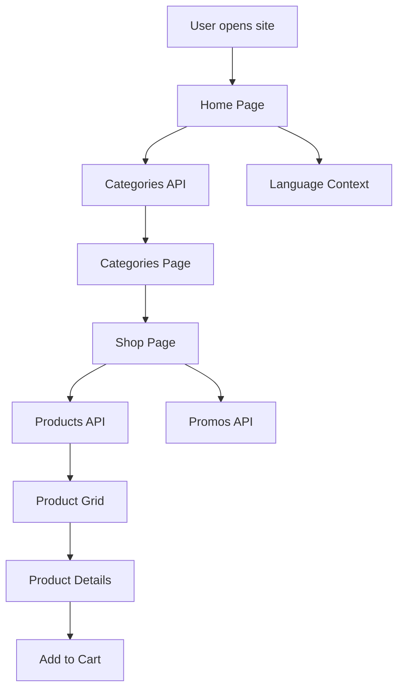
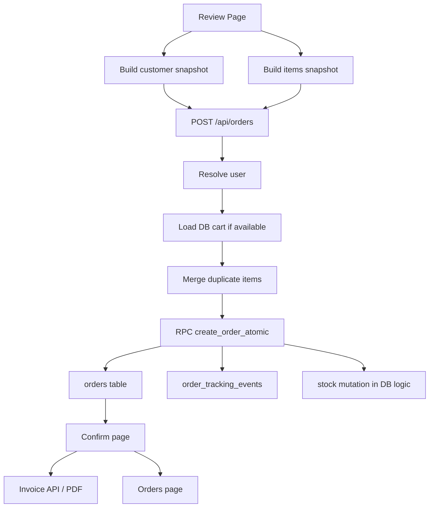
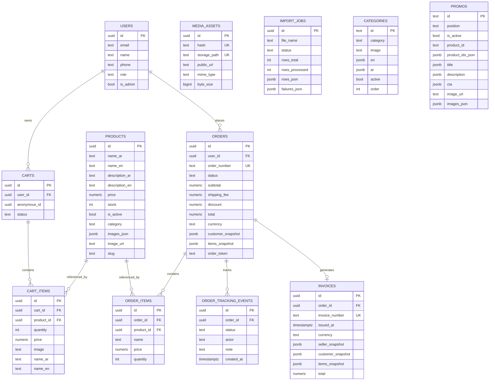
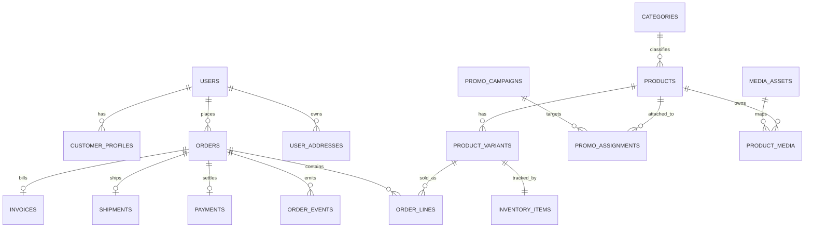
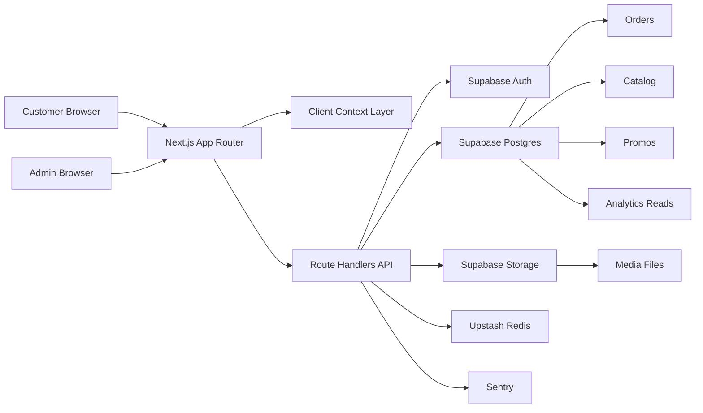
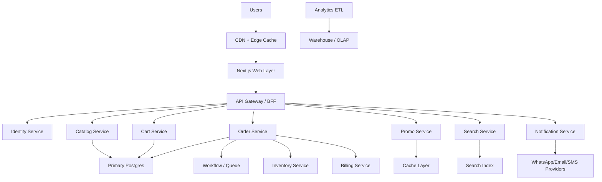

# Cesar Store Project Dossier

تاريخ التحليل: `2026-05-08`
حالة المشروع: `Active Development`
نوع الوثيقة: `Master Technical Handover + Product + Architecture + Scaling Blueprint`

---

## 1) الملخص التنفيذي

`Cesar Store` هو متجر إلكتروني موجه لمنتجات السيارات وملحقاتها، مبني حالياً على **Next.js 14 App Router** مع **Supabase** كقاعدة بيانات ومصادقة وتخزين، و**Upstash Redis** للـ rate limiting والجلسات الإدارية.  
المشروع اليوم ليس Microservices فعلياً، بل **Modular Monolith** منظم إلى:

- واجهة متجر للعملاء
- مصادقة المستخدمين
- سلة ومراحل Checkout
- نظام طلبات وتتبع
- لوحة إدارة
- نظام Promo Blocks
- نظام رفع صور وإدارة Media
- استيراد منتجات من Excel
- Analytics ولوحات تشغيلية
- Error Monitoring عبر Sentry

المشروع وصل إلى مرحلة جيدة من حيث:

- وجود متجر حي وقابل للاستخدام
- وجود إدارة منتجات/أقسام/طلبات
- وجود Order Flow فعلي
- وجود Invoice API وPDF
- وجود Realtime جزئي
- وجود Imports وMedia deduplication
- وجود مراقبة أخطاء

لكن ما يزال يحتاج عملاً واضحاً قبل أن يصبح منصة تضاهي `Amazon / Shopify / Noon`:

- توحيد المعمارية
- سد الفجوة بين الكود وSchema القاعدة
- تقوية الأمان
- تحسين الأداء
- تقليل الاعتماد على Client Fetching
- بناء Testing حقيقي
- فصل الخدمات Domain-wise
- بناء Search / Inventory / Payments / Notifications / Audit / Observability بشكل ناضج

---

## 2) نطاق هذا التحليل

تمت مراجعة:

- جميع ملفات `app/`
- جميع ملفات `components/`
- جميع ملفات `context/`
- جميع ملفات `hooks/`
- جميع ملفات `lib/`
- جميع ملفات `types/`
- ملفات `supabase/` الخاصة بالهجرات والتصميم والتحليلات
- سكربتات `scripts/`
- بيانات `data-store/`
- إعدادات المشروع الأساسية

تم أيضاً تنفيذ فحص خفيف:

- `npm run lint` نجح
- `next build` لم أُكمله لأنك أوضحت أن تكرار هذا الاختبار يأخذ وقتاً طويلاً

نتيجة `lint` الحالية:

- لا توجد أخطاء blocking
- توجد تحذيرات أساسية حول:
  - استخدام `` بدل `next/image`
  - بعض `useEffect` ينقصها dependencies

---

## 3) صورة المشروع في سطر واحد

**منصة تجارة إلكترونية عربية/ثنائية اللغة لمنتجات السيارات، مبنية كتطبيق Next.js واحد كبير مع Supabase backend، وفيها بداية قوية للطلبات والإدارة والتحليلات، لكنها ما زالت في مرحلة pre-scale وتحتاج Hardening معماري وتشغيلي قبل التوسع الكبير.**

---

## 4) الـ Tech Stack

### Frontend

- `Next.js 14.2.5`
- `React 18`
- `TypeScript`
- `Tailwind CSS`
- `Lucide React`
- `react-hot-toast`

### Backend داخل نفس المشروع

- `Next.js Route Handlers`
- `Supabase JS`
- `Supabase SSR`
- `Supabase Auth`
- `Supabase Storage`
- `Supabase Realtime`

### Infra / Platform

- `Supabase PostgreSQL`
- `Upstash Redis`
- `Sentry`

### ملفات/أدوات مساعدة

- `xlsx` لاستيراد المنتجات
- `@react-pdf/renderer` لتوليد الفواتير PDF
- `arabic-reshaper` لدعم العربية في PDF

---

## 5) نوع المعمارية الحالية

### الحالة الحالية

المشروع **Modular Monolith** وليس Microservices.

يعني ذلك أن:

- كل شيء داخل Repository واحدة
- نفس التطبيق يقدّم الواجهة والـ API والإدارة
- نفس deployment غالباً يحمل customer app + admin + APIs
- الفصل الحالي منطقي على مستوى الملفات وليس على مستوى الخدمات المستقلة

### لماذا هذا مهم؟

هذا النوع ممتاز للسرعة في البداية، لكنه مع الزمن يسبب:

- Coupling مرتفع
- صعوبة التوسع الأفقي على مستوى Domain
- صعوبة ownership بين الفرق
- صعوبة عزل الأعطال
- تضخم في build/deploy

---

## 6) شجرة المشروع المنطقية

### أحجام تقريبية للطبقات

- `app`: 66 ملفاً تقريباً
- `components`: 12 ملفاً
- `context`: 5 ملفات
- `hooks`: 1 ملف
- `lib`: 22 ملفاً
- `scripts`: 1 ملف
- `supabase`: 8 ملفات SQL/Config رئيسية
- `types`: 3 ملفات

### الشجرة المختصرة المهمة

```text
cesar-store/
├─ app/
│  ├─ layout.tsx
│  ├─ page.tsx
│  ├─ globals.css
│  ├─ global-error.tsx
│  ├─ shop/page.tsx
│  ├─ categories/page.tsx
│  ├─ product/[id]/page.tsx
│  ├─ cart/page.tsx
│  ├─ orders/page.tsx
│  ├─ orders/[id]/page.tsx
│  ├─ auth/
│  │  ├─ login/page.tsx
│  │  ├─ register/page.tsx
│  │  ├─ callback/route.ts
│  │  └─ sync/
│  ├─ (checkout)/
│  │  ├─ layout.tsx
│  │  ├─ checkout/page.tsx
│  │  ├─ review/page.tsx
│  │  └─ confirm/
│  ├─ admin-login/page.tsx
│  ├─ admin/
│  │  ├─ layout.tsx
│  │  ├─ AdminClientLayout.tsx
│  │  ├─ page.tsx
│  │  ├─ analytics/page.tsx
│  │  ├─ charts/page.tsx
│  │  ├─ errors/page.tsx
│  │  ├─ categories/
│  │  ├─ products/
│  │  ├─ orders/
│  │  └─ promos/
│  └─ api/
│     ├─ products/
│     ├─ categories/
│     ├─ promos/
│     ├─ cart/
│     ├─ orders/
│     ├─ invoice/
│     ├─ invoice-pdf/
│     ├─ upload/
│     └─ admin/
├─ components/
│  ├─ Navbar.tsx
│  ├─ category/CategoryCard.tsx
│  ├─ product/ProductCard.tsx
│  ├─ product/ProductGrid.tsx
│  └─ promo/
├─ context/
│  ├─ AuthContext.tsx
│  ├─ CartContext.tsx
│  ├─ CheckoutContext.tsx
│  ├─ LanguageContext.tsx
│  └─ OrderTrackingContext.tsx
├─ lib/
│  ├─ supabase/
│  ├─ services/
│  ├─ server/
│  ├─ admin/
│  ├─ auth/
│  ├─ infra/redis.ts
│  ├─ rateLimit.ts
│  ├─ image-normalizer.ts
│  ├─ image-safe.ts
│  ├─ category-normalizer.ts
│  └─ formatCurrency.ts
├─ supabase/
│  ├─ migrations/
│  ├─ analytics/analytics_aggregations.sql
│  └─ design/order_versions.design.sql
├─ scripts/cleanup-storage.ts
├─ data-store/
│  ├─ categories.json
│  ├─ products.json
│  └─ promos.json
└─ types/
   ├─ product.ts
   ├─ promo.ts
   └─ product-import.ts
```

### ملاحظات على الشجرة

- يوجد تضخم واضح في `public/` بسبب عدد ضخم من الصور والخطوط والنسخ الاحتياطية
- توجد ملفات UI قديمة/placeholder مثل `components/layout/*` و`components/explore/*`
- توجد وثائق تحليلية قديمة ومتعددة في الجذر، ما يدل على غياب Single Source of Truth واحد

---

## 7) الوحدات الوظيفية الحالية

### 7.1 Storefront

يشمل:

- الصفحة الرئيسية `app/page.tsx`
- صفحة الأقسام `app/categories/page.tsx`
- صفحة المتجر `app/shop/page.tsx`
- صفحة تفاصيل المنتج `app/product/[id]/page.tsx`
- الـ Navbar والسلة واللغة

الخصائص:

- دعم عربي/إنجليزي
- عرض الفئات
- عرض المنتجات
- فلترة حسب القسم
- بحث نصي محلي
- sorting
- Promo sliders جانبية في صفحات محددة

### 7.2 Authentication

يشمل:

- login/register
- Google OAuth
- Apple OAuth
- auth callback
- sync step بعد OAuth

ملاحظات:

- يوجد مسار OAuth عملي
- يوجد اعتماد واضح على Supabase Auth
- صفحة التسجيل فيها منطق غير مثالي لأنها تستدعي `supabase.auth.admin.listUsers()` من client-side logic

### 7.3 Cart

يشمل:

- Local cart في المتصفح
- Sync إلى قاعدة البيانات عند تسجيل الدخول
- Merge بين local cart وDB cart
- Stock validation عند الإضافة/التعديل

نقطة قوة:

- الدمج بين cart المحلي وcart قاعدة البيانات جيد كبداية

نقطة ضعف:

- ما يزال منطق السلة موزعاً بين Context وAPI وService وفيه ازدواجية

### 7.4 Checkout

المسار:

- `checkout` إدخال بيانات العميل
- `review` مراجعة الطلب
- `confirm` صفحة النجاح

المشروع حالياً يستخدم:

- تخزين بيانات checkout محلياً
- إرسال order token
- بناء WhatsApp message
- فتح WhatsApp بعد تأكيد الطلب

### 7.5 Orders

يشمل:

- إنشاء الطلب
- قراءة قائمة الطلبات
- عرض تفاصيل الطلب
- تتبع الحالة Realtime
- Invoice JSON
- Invoice PDF

الملاحظة الأهم:

- إنشاء الطلب الحقيقي يعتمد على **Supabase RPC** اسمها `create_order_atomic`
- هذه الدالة **غير موجودة في ملفات الهجرات الموجودة داخل المشروع**
- هذا يعني أن جزءاً حساساً من المنطق موجود في قاعدة البيانات لكنه غير موثق بالكامل داخل الـ repo

### 7.6 Admin Panel

تشمل:

- Login مستقل للإدارة
- Dashboard
- Orders management
- Archive/Restore/Delete
- Product management
- Category management
- Promo management
- Analytics
- Charts
- Errors

### 7.7 Media & Uploads

يشمل:

- رفع صور من ملف أو URL
- Deduplication بالـ MD5 hash
- تخزين المسارات في `media_assets`
- حذف الصور غير المستخدمة

هذه من أفضل الأجزاء تنظيماً في المشروع.

### 7.8 Product Import

يشمل:

- قراءة Excel
- Preview
- Warnings
- إنشاء import job
- Process chunked import
- image caching
- failure reporting

### 7.9 Observability

- Sentry client/server/edge
- Global error boundary
- صفحة أخطاء للإدارة
- example routes لاختبار Sentry

---

## 8) تدفقات النظام الأساسية

## 8.1 تدفق تصفح العميل



## 8.2 تدفق السلة والدمج

```mermaid
flowchart TD
    A[Guest adds items] --> B[LocalStorage Cart]
    C[User logs in] --> D[AuthContext]
    D --> E[/api/cart/merge]
    B --> E
    E --> F[Supabase carts]
    E --> G[Supabase cart_items]
    G --> H[/api/cart/items]
    H --> I[CartContext syncs local state]
```

## 8.3 تدفق إنشاء الطلب



## 8.4 تدفق الإدارة

```mermaid
flowchart TD
    A[Admin Login] --> B[/api/admin/login]
    B --> C[Signed cookie + Redis session]
    C --> D[Middleware validates cookie]
    D --> E[Admin pages]
    E --> F[Products]
    E --> G[Orders]
    E --> H[Promos]
    E --> I[Analytics]
    E --> J[Errors]
```

---

## 9) قاعدة البيانات الحالية

## 9.1 الوضع الواقعي

المشروع فيه ثلاث طبقات لفهم قاعدة البيانات:

1. **Schema context file**: `Database Schema.txt`
2. **Executed migrations**: داخل `supabase/migrations`
3. **Design-only future schema**: داخل `supabase/design` و`supabase/analytics`

هذا يعني أن الـ repo لا يحتوي snapshot واحداً موحداً ونهائياً لقاعدة البيانات الحالية.

## 9.2 الجداول الحالية المؤكدة من الكود والـ schema

- `users`
- `products`
- `categories`
- `promos`
- `carts`
- `cart_items`
- `orders`
- `order_items`
- `order_tracking_events`
- `invoices`
- `media_assets`
- `import_jobs`

## 9.3 علاقات مهمة

- `users -> carts`
- `carts -> cart_items`
- `products -> cart_items`
- `orders -> order_items`
- `orders -> order_tracking_events`
- `orders -> invoices`
- `products` مرتبطة منطقياً بـ `categories` عبر حقل نصي وليس FK
- `promos` ترتبط منطقياً بـ `products` عبر `product_id` و`product_ids_json`

---

## 10) ERD الحالي



### ملاحظات على ERD الحالي

- `products.category` ليس FK إلى `categories.id`
- `orders.status` موجود وفي نفس الوقت يوجد `order_tracking_events`
- هذا يعني duplication في مصدر الحقيقة الخاص بالحالة
- `order_items` و`items_snapshot` موجودان معاً
- هذا يعني duplication مقصود جزئياً لكنه يحتاج حوكمة واضحة

---

## 11) ERD المستهدف الأفضل

النسخة الأنضج المقترحة:

- جعل `categories` relation حقيقية
- فصل inventory عن product catalog
- جعل order status مشتقاً من event stream أو workflow state machine
- جعل snapshots immutable وواضحة
- إضافة payment/shipments/notifications/audit



---

## 12) Tables & Data Semantics

## 12.1 `products`

وظيفتها:

- Catalog الأساسي
- اسم عربي/إنجليزي
- وصف عربي/إنجليزي
- سعر
- مخزون
- حالة تفعيل
- صور متعددة

ملاحظات:

- المخزون موجود داخل نفس جدول المنتج
- هذا مناسب كبداية لكنه غير مناسب للتوسع الكبير
- الأفضل لاحقاً نقل المخزون إلى `inventory_items`

## 12.2 `categories`

وظيفتها:

- تصنيف العرض
- نصوص مترجمة
- ترتيب
- صورة

مشكلة حالية:

- الربط بالمنتجات نصي وليس FK

## 12.3 `promos`

وظيفتها:

- التحكم ببلوكات ترويجية في `shop` و`categories`
- دعم multi-product
- دعم صور متعددة

ملاحظة:

- الـ schema تطورت تدريجياً من single-product إلى multi-product
- الكود يحتفظ بدعم legacy fallback

## 12.4 `carts` و`cart_items`

وظيفتها:

- cart نشطة لكل مستخدم
- حفظ quantity
- حفظ snapshot مبسط من المنتج داخل cart item

ميزة:

- تقليل تكلفة join عند العرض

مخاطرة:

- احتمال stale data إذا تغير المنتج ولم تحدث cart snapshot

## 12.5 `orders`

وظيفتها:

- immutable business snapshot
- customer snapshot
- items snapshot
- totals
- currency
- token لمنع التكرار

ملاحظة مهمة:

- يوجد اعتماد قوي على `order_token` و`create_order_atomic`

## 12.6 `order_tracking_events`

وظيفتها:

- event stream لحالة الطلب
- actor/admin/system note

هذه table ممتازة أساساً لبناء workflow صحيح.

## 12.7 `invoices`

وظيفتها:

- snapshot محاسبي مستقل
- seller/customer/items/totals

## 12.8 `media_assets`

وظيفتها:

- deduplication
- tracking للملفات المرفوعة
- ربط hash بمسار التخزين وpublic URL

## 12.9 `import_jobs`

وظيفتها:

- تتبع استيراد المنتجات
- rows processed/success/failed/skipped
- rows_json cached
- image cache

---

## 13) System Design Whiteboard



### التفسير

- `Next.js` هو طبقة العرض وطبقة الـ API معاً
- `Supabase` هو مصدر الحقيقة للبيانات
- `Redis` مستخدم حالياً في الجلسات الإدارية والـ rate limiting
- `Sentry` هو طبقة المراقبة

---

## 14) تفكيك المشروع إلى Microservices مستقبلياً

## 14.1 الحالة اليوم

لا توجد Microservices حقيقية، لكن حدودها المنطقية واضحة ويمكن استخراجها.

## 14.2 الـ Breakdown المقترح

### 1. Identity Service

المسؤوليات:

- users
- auth
- roles
- admin permissions
- profile data

### 2. Catalog Service

المسؤوليات:

- products
- categories
- product media
- pricing base data
- localization metadata

### 3. Inventory Service

المسؤوليات:

- stock ledger
- reservations
- low-stock alerts
- restock workflows

### 4. Cart Service

المسؤوليات:

- customer cart
- merge rules
- cart snapshots
- cart expiry

### 5. Order Service

المسؤوليات:

- create order
- order snapshots
- idempotency
- order lifecycle orchestration

### 6. Fulfillment Service

المسؤوليات:

- status transitions
- shipment creation
- cancellation rules
- return/refund لاحقاً

### 7. Promotion Service

المسؤوليات:

- promo campaigns
- placements
- product targeting
- scheduling

### 8. Media Service

المسؤوليات:

- upload
- hashing
- deduplication
- image variants
- CDN links

### 9. Analytics Service

المسؤوليات:

- materialized views
- dashboards
- reporting
- OLAP style workloads

### 10. Notification Service

المسؤوليات:

- WhatsApp
- email
- SMS
- admin alerts

### 11. Billing / Invoice Service

المسؤوليات:

- invoice generation
- PDF rendering
- tax rules
- accounting exports

### 12. Audit & Security Service

المسؤوليات:

- admin audit log
- security events
- anomaly detection
- force logout / revocation

---

## 15) Performance Review

## 15.1 نقاط جيدة موجودة

- deduplicated uploads
- Redis rate limiting
- order creation مصمم حول atomic RPC
- Realtime في بعض المناطق
- chunked import jobs
- output tracing exclusions في `next.config.js`

## 15.2 نقاط ضعف الأداء الحالية

### A. كثافة عالية في `public/`

- عدد الصور tracked كبير جداً
- نسخ مكررة وbackup assets
- خطوط كثيرة ومكررة
- هذا يبطئ repository والعمل وbuild وdeploy

### B. الاعتماد الكبير على Client Fetch

الصفحات الرئيسية تسحب بياناتها من الـ browser بدلاً من server components المدروسة:

- `/`
- `/shop`
- `/categories`
- `/product/[id]`
- `/orders`
- `/admin/*`

الأثر:

- latency أعلى
- waterfall requests
- SEO أضعف في بعض الصفحات
- تحميل أولي أثقل

### C. استخدام `` بدل `next/image`

ظهر في `lint` بوضوح.

الأثر:

- LCP أضعف
- صور أكبر من اللازم
- غياب optimization وresponsive sizing

### D. عدم وجود caching strategy واضحة

لا يوجد تنظيم واضح لـ:

- ISR
- route caching
- fetch cache
- revalidation tags
- CDN image variants

### E. Queries مفتوحة بدون pagination أو limits كافية

أمثلة:

- `/api/products` يرجّع كل المنتجات
- بعض لوحات الإدارة والـ analytics تسحب مجموعات كبيرة

### F. Realtime غير مضبوط على كل النطاقات

- بعض القنوات تعيد تحميل البيانات كاملة
- ليس هناك event payload minimization أو optimistic update مدروس

### G. PDF generation on-demand

- PDF يتولد وقت الطلب
- هذا جيد للحجم الصغير
- لكنه سيصبح bottleneck عند نمو الطلبات

---

## 16) خطة Performance Tuning

## المرحلة 1: تحسينات سريعة

- استبدال الصور الحرجة إلى `next/image`
- حذف backup assets والملفات غير المستخدمة
- ضغط الصور وتوحيد الامتدادات
- pagination للمنتجات والطلبات
- server-side fetch للصفحات الرئيسية المهمة
- تخفيف client waterfall

## المرحلة 2: تحسينات متوسطة

- CDN strategy للصور
- image variants/thumbnail generation
- cache tags للمنتجات/الأقسام/promos
- materialized analytics tables
- background invoice generation

## المرحلة 3: تحسينات متقدمة

- dedicated search index
- inventory reservation layer
- queue-based workflows
- event-driven notifications
- read models منفصلة للـ analytics

---

## 17) Security Review

## 17.1 إيجابيات

- admin cookie موقعة HMAC
- Redis session persistence للإدارة
- middleware لحماية `/admin` و`/api/admin`
- rate limiting موجود
- رفع الصور فيه حماية أساسية ضد localhost/internal URLs

## 17.2 مخاطر مهمة جداً

### 1. Secrets management غير ناضج

ملف `.env.local` يحتوي أسرار تشغيل حقيقية محلياً.  
الوثيقة لا تعيد نشر القيم، لكن وجودها بهذه الصورة يعني ضرورة:

- تدوير كل المفاتيح الحساسة
- نقلها إلى Secret Manager
- منع مشاركتها أو نسخها في الوثائق

### 2. مسار التسجيل يحتوي منطق Admin-like من جهة العميل

`register/page.tsx` يستخدم `supabase.auth.admin.listUsers()` من سياق client.  
هذا نمط غير آمن وغير صحيح معمارياً.

### 3. Reset secret ضعيف جداً من ناحية التصميم

`/api/admin/analytics/reset` يعتمد على secret header بسيط بالإضافة إلى التحقق الإداري.  
هذا endpoint شديد الحساسية ويجب أن يُقفل أكثر.

### 4. Force logout implementation غير متناسق

يوجد كتابة `admin_session_version` في Redis لكن التحقق الفعلي من هذا version غير موحد في كل المسار.

### 5. بعض مسارات CRUD لا تستخدم طبقة تفويض موحدة

هناك تفاوت بين:

- `validateAdminSession`
- middleware
- service role direct access

### 6. Service role usage واسع

العديد من route handlers تستخدم `SUPABASE_SERVICE_ROLE_KEY` مباشرة.

هذا طبيعي جزئياً في backend، لكن يحتاج:

- service boundary واضحة
- input validation موحدة
- audit logging

---

## 18) Observability & Reliability

## الموجود

- Sentry client/server/edge
- Global error capture
- Admin errors page
- Logging داخل order routes

## الناقص

- structured logs
- correlation IDs
- tracing across order lifecycle
- metrics dashboard حقيقي
- alerting rules
- synthetic health checks

---

## 19) مشاكل معمارية مكتشفة أثناء التحليل

## 19.1 Schema Drift

أخطر نقطة حالية.

الكود يشير إلى عناصر ليست موثقة بوضوح في الهجرات الموجودة:

- `create_order_atomic`
- `archived_at`
- `admin_audit_logs`
- `low_stock_threshold`
- `order_token`
- `order_versions` مستخدم منطقياً في analytics design لكن غير منفذ هنا

هذا يعني أن:

- الـ repo لا يمثل DB truth بشكل كامل
- onboarding المطور الجديد سيكون صعباً
- deployment جديد قد يفشل إن لم تكن القاعدة مهيأة خارج هذا الـ repo

## 19.2 تعدد مصادر الحقيقة للحالة

حالة الطلب موجودة في:

- `orders.status`
- `order_tracking_events`

الحل الأفضل:

- اختيار مصدر أساسي واحد
- أو جعل `orders.status` مجرد denormalized latest state يحدث أوتوماتيكياً

## 19.3 تعدد مصادر الحقيقة للعناصر

عناصر الطلب موجودة في:

- `items_snapshot`
- `order_items`

هذا جيد إذا كان القرار متعمداً، لكن يجب توثيق:

- من هو source of truth؟
- متى يُقرأ snapshot؟
- متى تُقرأ rows المنفصلة؟

## 19.4 تكرار المنطق

يوجد منطق مشابه موزع بين:

- contexts
- route handlers
- services

خصوصاً في cart/orders/auth/admin.

## 19.5 وجود UI placeholders / legacy files

مثل:

- `components/layout/*`
- `components/explore/*`
- ملفات تحليل ووثائق قديمة متعددة

هذا يزيد التشويش المعرفي.

---

## 20) خطة Scaling إلى 1M Users

## 20.1 ما الذي سيتكسر أولاً إذا نمونا بسرعة؟

### 1. `/api/products`

- يرجع كل المنتجات
- بدون search engine
- بدون pagination
- بدون cache model قوية

### 2. order lifecycle

- يعتمد على RPC غير موثقة داخل repo
- لا توجد queue/retry orchestration قوية

### 3. الصور

- تخزين الصور وضخامة `public/` ستؤثر على build والـ repo
- يجب أن تعتمد المنصة على object storage + CDN وليس ملفات tracked

### 4. analytics

- القراءة المباشرة من الجداول التشغيلية ستصبح مكلفة

### 5. الإدارة

- admin pages تسحب بيانات كبيرة وتعمل filtering بالواجهة

---

## 20.2 البنية المستهدفة لـ 1M users



## 20.3 What to implement to reach that scale

### Layer 1: Delivery

- CDN for assets
- Edge caching
- static + ISR for catalog pages

### Layer 2: Reads

- search index
- product listing pagination
- cached promo payloads
- cached category payloads

### Layer 3: Writes

- queue order events
- reserve stock atomically
- idempotency store
- retryable workflows

### Layer 4: Data

- split read/write concerns
- analytics warehouse
- inventory ledger

### Layer 5: Operations

- dashboards
- alerts
- SLOs
- incident playbooks

---

## 21) Database Evolution Plan

## المرحلة 1

- إضافة migrations المفقودة
- توحيد schema snapshot
- إضافة FK حقيقية حيث يلزم
- إضافة index review

## المرحلة 2

- فصل inventory
- فصل payments
- فصل notifications
- materialized analytics

## المرحلة 3

- order events + workflow engine
- search index
- archival/retention policies

---

## 22) الفجوات التي تمنع المشروع من منافسة المنصات الكبرى الآن

### Product gaps

- لا يوجد payment gateway متكامل
- لا يوجد shipping providers integration
- لا يوجد returns/refunds
- لا يوجد coupons/promotions engine متقدم
- لا يوجد wishlist
- لا يوجد reviews
- لا يوجد account/profile management متكامل
- لا يوجد advanced search
- لا يوجد recommendation engine

### Technical gaps

- no automated tests
- no CI quality gate واضح
- no typed schema generation من Supabase
- no strict mode فعلي في TypeScript
- no production-grade audit strategy
- no event bus
- no domain isolation

### Operational gaps

- no infra-as-code واضح
- no staging strategy موثقة
- no deployment checklist موثقة
- no incident response guide

---

## 23) خطة التطوير الزمنية المقترحة

## Sprint 1: Stabilization (1-2 أسبوع)

- توحيد وتوثيق الـ DB schema
- نقل الأسرار إلى secret manager
- معالجة مسارات admin الحساسة
- حذف الملفات غير المستخدمة والـ backup assets
- إصلاح `useEffect` warnings
- تقليل `` الحرجة

## Sprint 2: Catalog & Performance (2-3 أسابيع)

- pagination للمنتجات
- server components للصفحات الأساسية
- image optimization
- cache strategy
- تحسين product/category relations

## Sprint 3: Orders Hardening (2-3 أسابيع)

- توثيق/إضافة `create_order_atomic` migration
- توحيد order status model
- audit trail حقيقي
- notification abstraction بدل WhatsApp المباشر فقط

## Sprint 4: Admin Maturity (2 أسبوع)

- refactor admin tables
- bulk operations آمنة
- role-based admin permissions
- better analytics filters

## Sprint 5: Testing & CI (2 أسبوع)

- unit tests للخدمات
- integration tests للـ API
- e2e for cart/checkout/order
- build/lint/test pipeline

## Sprint 6: Scale Foundations (3-4 أسابيع)

- search
- queues
- inventory service abstraction
- notification service
- warehouse/analytics pipeline

---

## 24) خطة الاختبار القادمة

هذه هي **الخطوة التالية المباشرة** التي أنصح بها.

## 24.1 طبقة Unit Tests

اختبر:

- `normalizeCategory`
- `normalizeImagePath`
- `normalizeImagesArray`
- `formatCurrency`
- `buildProductKey`
- cart merge helpers
- promo mapping helpers

## 24.2 طبقة Integration Tests

اختبر:

- `/api/products`
- `/api/categories`
- `/api/promos`
- `/api/cart`
- `/api/cart/items`
- `/api/orders`
- `/api/admin/order-tracking`
- `/api/upload`

## 24.3 طبقة E2E

السيناريوهات الحرجة:

1. guest adds to cart
2. login and merge cart
3. checkout and create order
4. admin confirms order
5. admin ships order
6. customer tracks order
7. invoice opens
8. import products from Excel

## 24.4 طبقة Data Validation

- التحقق من schema drift
- التحقق من وجود RPC المطلوبة
- التحقق من الأعمدة المرجعية
- التحقق من consistency بين `orders.status` و`order_tracking_events`

---

## 25) أسس حاكمة لسير البرمجة في المشروع

### 1. Source of Truth واضح

لكل مفهوم:

- حالة الطلب
- عناصر الطلب
- المخزون
- جلسة الإدارة
- promo assignments

يجب أن يكون له مصدر حقيقة واحد واضح.

### 2. Repo must describe production

أي schema أو RPC أو trigger أو view مستخدمة في الإنتاج يجب أن تكون ممثلة داخل الـ repo.

### 3. No secrets in docs or tracked files

- تدوير المفاتيح
- استخدام secret manager
- منع التسريب في الوثائق

### 4. Domain-first architecture

التنظيم المستقبلي يجب أن يكون حسب:

- catalog
- cart
- orders
- inventory
- promotions
- analytics

وليس حسب page فقط.

### 5. Testing before scale

أي توسع كبير بدون test coverage سيحول المشروع إلى fragile system.

### 6. Observability before microservices

قبل فصل الخدمات يجب أولاً:

- logging
- tracing
- metrics
- alerting

### 7. Idempotency everywhere in writes

خصوصاً في:

- order creation
- payment webhooks
- stock mutation
- notification dispatch

---

## 26) التوصيات الأعلى أولوية

### أولوية حرجة جداً

- توثيق وإضافة migrations المفقودة
- تدوير الأسرار الحساسة
- إزالة المنطق غير الآمن من التسجيل
- تقوية admin reset/force logout

### أولوية عالية

- تحسين الصور والأداء
- pagination + caching
- توحيد order status semantics
- تقليل duplication في cart/order logic

### أولوية متوسطة

- search
- notifications abstraction
- audit log حقيقي
- warehouse analytics

---

## 27) تقييم نضج المشروع الحالي

### Product Maturity

- `6.5/10`

### Engineering Maturity

- `5.5/10`

### Security Maturity

- `4.5/10`

### Scale Readiness

- `4/10`

### Admin/Operations Readiness

- `6/10`

### Overall

- **المشروع واعد وقابل للتحول إلى منصة قوية، لكنه يحتاج مرحلة Hardening جادة قبل أن يدخل طور المنافسة الثقيلة.**

---

## 28) الخلاصة النهائية

`Cesar Store` اليوم عبارة عن **نواة تجارة إلكترونية جيدة ومتحركة فعلاً**، فيها:

- Catalog
- Cart
- Checkout
- Orders
- Admin
- Promos
- Imports
- Analytics
- Monitoring

وهذا ممتاز جداً مقارنة بمرحلة المشروع الحالية.

لكن لكي نصل إلى منصة تنافس كبار السوق، يجب أن نتحرك في هذا الترتيب:

1. **تثبيت الحقيقة المعمارية والـ DB**
2. **تقوية الأمان**
3. **تحسين الأداء**
4. **إدخال الاختبارات**
5. **فصل المجالات Domain-wise**
6. **إضافة Search / Notifications / Inventory / Payments**
7. **بناء Observability + Scale Foundations**

إذا تم تنفيذ هذه الخطة بشكل منضبط، فالمشروع يمكن أن يتحول من متجر جيد إلى **commerce platform عربية قوية وقابلة للتوسع فعلاً**.

---

## 29) Next Step المقترح مباشرة

الخطوة التالية العملية التي أوصي بها الآن:

**إنشاء Phase اسمها `Architecture Stabilization` لمدة 10-14 يوم، هدفها ليس إضافة Features جديدة، بل توحيد الـ schema، تنظيف الأصول، تقوية الأمان، وتأسيس test harness أولي.**

بدون هذه المرحلة، أي توسع قادم سيزيد سرعة تراكم الدين التقني أكثر من سرعة نمو المنتج.

