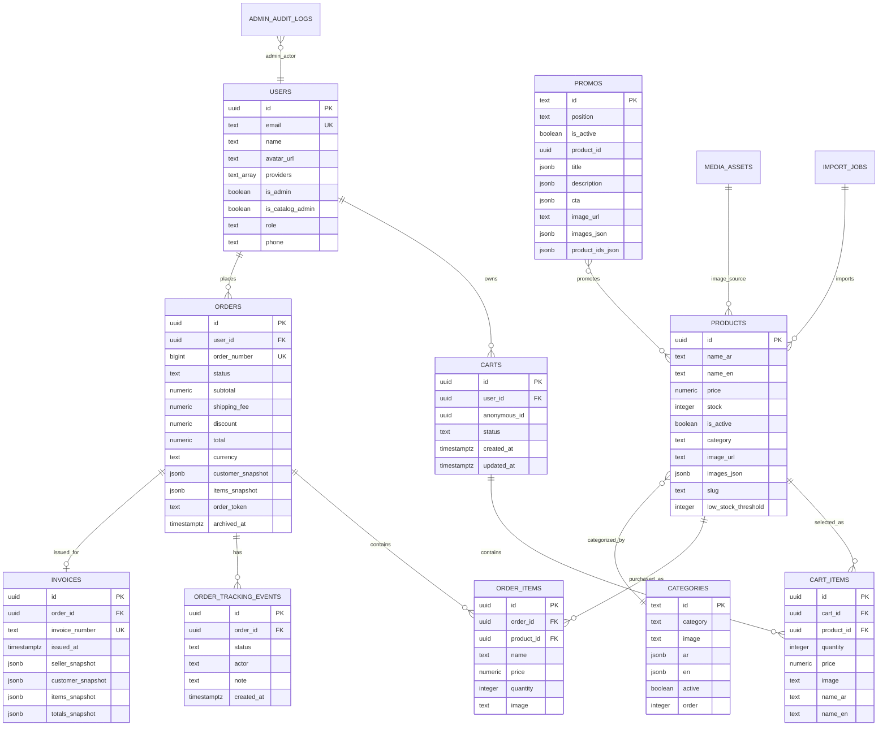
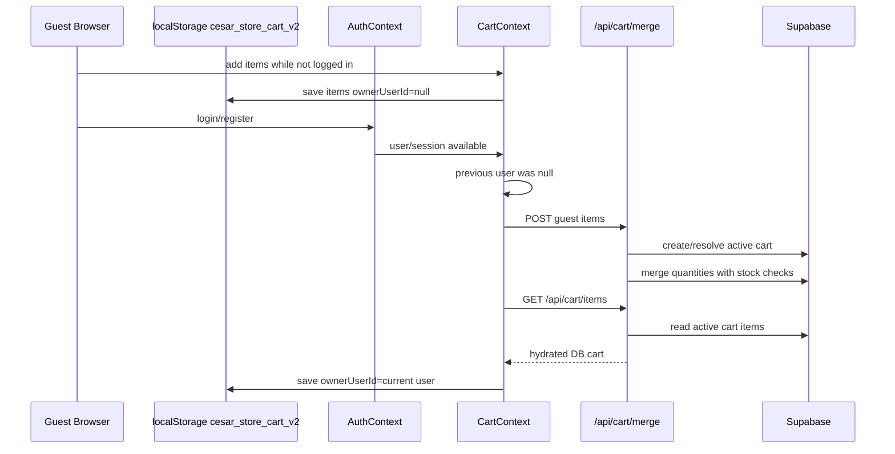
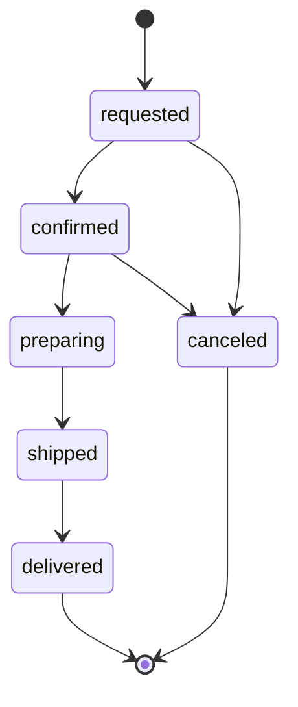
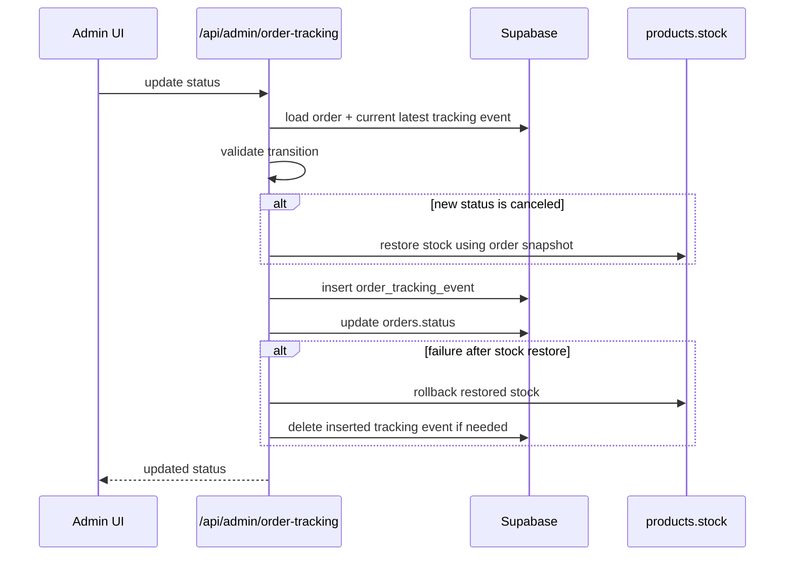
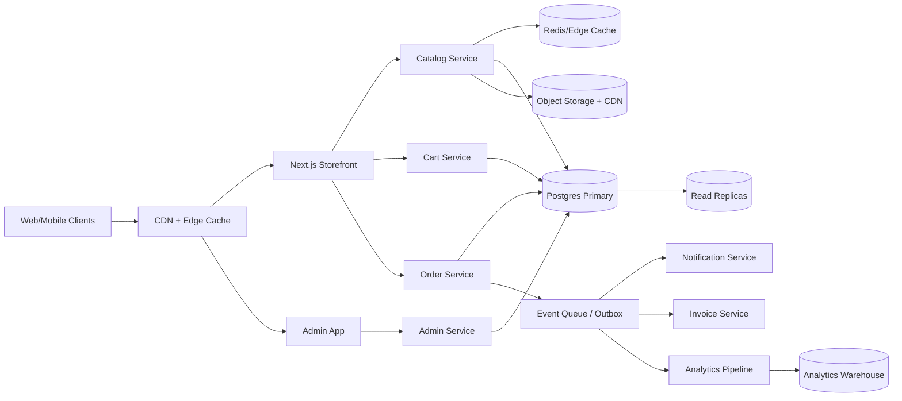

# Cesar Store Ultimate Project Dossier

تاريخ الوثيقة: 2026-05-10  
الغرض: وثيقة مرجعية شاملة لفهم مشروع Cesar Store قبل بدء أي شات جديد أو أي تعديل جديد، حتى لا يتم كسر منطق قائم بسبب فقدان تفصيلة صغيرة.

> قاعدة الاستخدام: قبل أي تعديل في المشروع، اقرأ الأقسام التالية أولًا: `Protected Invariants`, ثم `Critical Flows`, ثم `Known Risks`, ثم الملف المطلوب تعديله فقط.

---

## 1. Executive Summary

Cesar Store هو متجر إلكتروني مبني بـ Next.js App Router مع Supabase كقاعدة بيانات ومصدر مصادقة وStorage، وRedis/Upstash لمساندة rate limiting أو caching. المشروع يحتوي على واجهة متجر للعملاء، لوحة إدارة، نظام سلة مشتريات، Checkout، إنشاء طلبات ذرّي داخل قاعدة البيانات، تتبع حالات الطلب، أرشفة واسترجاع، فواتير، إدارة منتجات وتصنيفات وعروض، واستيراد منتجات وصور.

أخطر مناطق المشروع هي:

- منطق السلة: `context/CartContext.tsx` و `app/api/cart/items/route.ts` و `app/api/cart/merge/route.ts`.
- إنشاء الطلب: `app/api/orders/route.ts` و RPC `create_order_atomic`.
- تتبع الطلبات والأرشفة: `app/api/admin/order-tracking/route.ts` و `app/api/admin/orders/**`.
- المخزون: يتم خصمه داخل RPC عند إنشاء الطلب، ويتم إرجاعه عند إلغاء الطلب من الإدارة.

المشروع وصل إلى حالة مهمة: الطلب الناجح يجب أن يمسح عناصر السلة من `cart_items` ويغلق السلال النشطة بوضع `ordered`، ويجب أن يحدث هذا بغض النظر عن قيمة `createdOrder.reused`.

---

## 2. How To Use This Document In A New Chat

انسخ هذا الطلب في أي شات جديد:

```text
اقرأ ملف CESAR_STORE_ULTIMATE_PROJECT_DOSSIER_2026-05-10.md أولًا. لا تعدل منطق السلة أو الطلبات أو التتبع أو الأرشفة قبل فهم Protected Invariants وCritical Flows. أي تعديل يجب أن يكون جراحيًا، في أقل عدد ملفات، مع ذكر الملف والسبب والاختبار المستهدف قبل التنفيذ.
```

---

## 3. Technology Stack

- Framework: Next.js 14.2.5 App Router.
- UI: React 18.2, TypeScript, Tailwind CSS, lucide-react.
- Backend: Next.js Route Handlers تحت `app/api`.
- Database/Auth/Storage: Supabase.
- Server DB Access: `@supabase/supabase-js`, `@supabase/ssr`.
- PDF/Invoices: React PDF, QRCode.
- Import/Excel: `xlsx`.
- Monitoring: Sentry موجود في الاعتمادات.
- Rate limiting / Cache helper: Upstash Redis وملفات `lib/rate-limit`, `lib/redis`.

Scripts الأساسية:

```json
{
  "dev": "next dev",
  "build": "next build",
  "start": "next start",
  "lint": "next lint"
}
```

ملاحظة مهمة: لا يتم تشغيل build كامل إلا عند الضرورة القصوى، لأن المستخدم أوقفه سابقًا بسبب طول التنفيذ. استخدم تحققًا موجّهًا مثل `npx tsc --noEmit` أو `npx next lint --file path`.

---

## 4. Project File Tree

الشجرة التالية مختصرة وظيفيًا، وليست قائمة بكل صورة داخل `public`.

```text
cesar-store/
  app/
    (checkout)/
      checkout/page.tsx
      review/page.tsx
      confirm/page.tsx
    admin/
      analytics/
      archive/
      categories/
      charts/
      errors/
      login/
      orders/
      products/
      promos/
      page.tsx
    api/
      admin/
        analytics/
        archive/
        order-tracking/
        orders/
        products/
      auth/
      cart/
        items/
        merge/
      categories/
      invoice/
      invoice-pdf/
      orders/
      products/
      promos/
      upload/
    auth/
      callback/
      login/
      register/
      sync/
    cart/
    categories/
    orders/
    product/
    shop/
    globals.css
    layout.tsx
    page.tsx
  components/
    layout/
    product/
    ui/
    categories/
    promos/
  context/
    AuthContext.tsx
    CartContext.tsx
    CheckoutContext.tsx
    LanguageContext.tsx
    OrderTrackingContext.tsx
  data-store/
    categories.json
    products.json
    promos.json
  lib/
    admin/
    server/
    services/
    supabase/
    auth.ts
    rate-limit.ts
    redis.ts
  public/
    fonts/
    uploads/
    product/category/promo images
  supabase/
    migrations/
    analytics/
    design/
  types/
    product.ts
    promo.ts
    import.ts
  Database Schema.txt
  package.json
  tsconfig.json
```

---

## 5. Main Domain Model

### Core Tables

- `users`: مستخدمو المتجر، أدوار الإدارة، بيانات الحساب.
- `products`: المنتجات، السعر، الصور، المخزون، التصنيف.
- `categories`: التصنيفات.
- `promos`: العروض والبانرات.
- `carts`: السلال النشطة أو المغلقة.
- `cart_items`: عناصر السلة مع snapshot للسعر والاسم والصورة وقت الإضافة.
- `orders`: الطلبات، إجمالياتها، بيانات العميل، snapshots، الحالة الحالية، token idempotency.
- `order_items`: عناصر الطلب النهائية.
- `order_tracking_events`: سجل تتبع حالات الطلب.
- `invoices`: الفواتير.
- `media_assets`: أصول الصور المرفوعة والمدارة.
- `import_jobs`: مهام استيراد المنتجات.
- `admin_audit_logs`: سجل أفعال الإدارة.

### Database ERD Visual



ملاحظة: العلاقة بين `products.category` و `categories` غالبًا منطقية بالاسم أو المعرف وليست FK صريحة في كل المسارات. يجب تأكيدها قبل فرض constraint.

---

## 6. System Design Whiteboard

```mermaid
flowchart LR
  Browser[Customer Browser] --> NextUI[Next.js App Router UI]
  AdminBrowser[Admin Browser] --> AdminUI[Admin Pages]

  NextUI --> AuthCtx[AuthContext]
  NextUI --> CartCtx[CartContext]
  NextUI --> CheckoutCtx[CheckoutContext]

  CartCtx --> CartAPI[/api/cart/items + /api/cart/merge]
  CheckoutCtx --> ReviewPage[Checkout Review Page]
  ReviewPage --> OrdersAPI[/api/orders]

  AdminUI --> AdminOrdersAPI[/api/admin/orders]
  AdminUI --> TrackingAPI[/api/admin/order-tracking]
  AdminUI --> CatalogAPI[/api/products /api/categories /api/promos]
  AdminUI --> AnalyticsAPI[/api/admin/analytics]

  OrdersAPI --> RPC[create_order_atomic RPC]
  RPC --> DB[(Supabase Postgres)]
  CartAPI --> DB
  AdminOrdersAPI --> DB
  TrackingAPI --> DB
  CatalogAPI --> DB
  AnalyticsAPI --> DB

  CatalogAPI --> Storage[(Supabase Storage)]
  UploadAPI[/api/upload] --> Storage

  OrdersAPI --> RateLimit[Rate Limit / Redis Helper]
  CartAPI --> RateLimit

  ReviewPage --> WhatsApp[WhatsApp Message Handoff]
```

---

## 7. Logical Microservices Breakdown

المشروع حاليًا monolith داخل Next.js، لكن يمكن تقسيمه منطقيًا إلى services وحدودية واضحة:

| Logical Service | Files / Area | Responsibility |
|---|---|---|
| Storefront Service | `app/page.tsx`, `app/shop`, `app/product`, `components/product` | عرض المنتجات، التصنيفات، تفاصيل المنتج |
| Auth/User Service | `context/AuthContext.tsx`, `app/auth/**`, `app/api/auth/**` | تسجيل الدخول، المزامنة، الجلسة |
| Cart Service | `context/CartContext.tsx`, `app/api/cart/**` | السلة المحلية، السلة في DB، الدمج، التحديث |
| Checkout Service | `context/CheckoutContext.tsx`, `app/(checkout)/**` | بيانات العميل، مراجعة الطلب، إرسال الطلب |
| Order Service | `app/api/orders/**`, RPC `create_order_atomic` | إنشاء الطلب، idempotency، تنظيف السلة |
| Inventory Service | RPC + `app/api/admin/order-tracking` | خصم المخزون وإرجاعه عند الإلغاء |
| Admin Orders Service | `app/admin/orders`, `app/api/admin/orders/**` | إدارة الطلبات، الأرشفة، الاسترجاع، الحذف النهائي |
| Catalog Service | `app/admin/products`, `app/api/products` | إدارة المنتجات |
| Category Service | `app/admin/categories`, `app/api/categories` | إدارة التصنيفات |
| Promotion Service | `app/admin/promos`, `app/api/promos` | إدارة العروض والبانرات |
| Media Service | `app/api/upload`, `lib/server/media-assets` | رفع الصور، dedup، تنظيف الصور |
| Import Service | `app/api/admin/products/import`, `import_jobs` | استيراد المنتجات على دفعات |
| Analytics Service | `app/admin/analytics`, `app/api/admin/analytics` | التقارير والإحصائيات |
| Invoice Service | `app/api/invoice`, `app/api/invoice-pdf` | توليد الفواتير وPDF |
| Observability Service | Sentry + error pages | مراقبة الأخطاء |

لو تم فصل المشروع مستقبلًا إلى microservices حقيقية، البداية تكون بفصل `Order + Inventory` ثم `Catalog + Media` ثم `Analytics`.

---

## 8. Protected Invariants

هذه القواعد لا يجب كسرها:

1. الطلب الناجح يمسح كل `cart_items` المرتبطة بكل السلال النشطة للمستخدم ويحوّل السلال إلى `ordered`.
2. تنظيف السلة بعد الطلب لا يعتمد على `createdOrder.reused`.
3. `create_order_atomic` هو مصدر الحقيقة عند إنشاء الطلب وخصم المخزون.
4. `order_token` يحمي من تكرار إنشاء نفس الطلب عند إعادة الإرسال.
5. سلة الضيف تندمج مع قاعدة البيانات فقط في سيناريو `guest -> login`.
6. تسجيل الخروج أو الانتقال من مستخدم إلى آخر لا ينقل سلة المستخدم السابق.
7. `localStorage` في السلة مجرد cache للواجهة، أما للمستخدم المسجل فقاعدة البيانات هي مصدر الحقيقة.
8. أرشفة الطلب لا تحذف `order_tracking_events` ولا `order_items`.
9. استرجاع الطلب من الأرشيف لا يعيد حالته إلى الحالة الأولى، بل يعرض آخر حالة من `order_tracking_events` مع fallback إلى `orders.status`.
10. إلغاء الطلب من الإدارة يعيد المخزون مرة واحدة فقط ضمن انتقال حالة صحيح.
11. الطلب snapshot غير قابل للتلاعب بعد إنشائه: أسماء وأسعار وصور العناصر تحفظ في `orders.items_snapshot` و `order_items`.
12. أي تعديل في `cart/orders/auth/admin tracking` يجب أن يكون جراحيًا وباختبار محدد.

---

## 9. Critical Flow: Guest Cart To Login Merge



حظر مهم: لا يتم merge عند `userA -> logout -> userB`. في هذه الحالة يجب تصفير السلة المحلية حتى لا تنتقل عناصر حساب إلى حساب آخر.

---

## 10. Critical Flow: Add / Update / Delete Cart Items

```mermaid
flowchart TD
  UI[Cart UI/Product UI] --> Optimistic[Optimistic local update]
  Optimistic --> AuthCheck{Logged in?}
  AuthCheck -- No --> LocalOnly[Save localStorage only]
  AuthCheck -- Yes --> CartAPI[/api/cart/items]
  CartAPI --> Rate[Operation-scoped rate limit]
  Rate --> ActiveCarts[Find active carts for user]
  ActiveCarts --> ProductCheck[Validate product active + stock]
  ProductCheck --> Existing{Item exists?}
  Existing -- Yes --> UpdateQty[Update primary row quantity]
  Existing -- No --> InsertItem[Insert snapshot row]
  UpdateQty --> Dedupe[Delete duplicate cart item rows]
  InsertItem --> Response[Return normalized cart]
  Dedupe --> Response
  Response --> UIRefresh[Refresh UI/local cache]
```

Expected current behavior:

- `POST`: يضيف أو يزيد الكمية.
- `PATCH`: يعدل كمية منتج موجود، ويرجع `stale=true` لو السطر اختفى.
- `DELETE`: يمسح منتج أو يمسح السلة كلها.
- وجود أكثر من active cart يتم التعامل معه دفاعيًا إلى أن يتم تنظيف البيانات وفرض unique index مستقبلًا.

---

## 11. Critical Flow: Checkout And Order Creation

```mermaid
sequenceDiagram
  participant UI as Review Page
  participant Orders as /api/orders
  participant DB as Supabase
  participant RPC as create_order_atomic
  participant Cart as carts/cart_items
  participant WA as WhatsApp

  UI->>Orders: POST customer + items + order_token
  Orders->>DB: verify authenticated user
  Orders->>Cart: read all active cart items
  Orders->>Orders: prefer DB cart; fallback to client items if DB unavailable/empty
  Orders->>Orders: normalize and merge duplicate items
  Orders->>RPC: create_order_atomic(user, items, customer, currency, token)
  RPC->>DB: advisory lock user+token
  RPC->>DB: return existing order if same token
  RPC->>DB: validate stock and product active
  RPC->>DB: decrement stock atomically
  RPC->>DB: insert order + order_items + requested tracking event
  RPC-->>Orders: created order or reused order
  Orders->>Cart: delete cart_items for active carts
  Orders->>Cart: update carts status='ordered'
  Orders-->>UI: order id/number/status
  UI->>UI: clearCart local state
  UI->>WA: open WhatsApp message
```

أهم إصلاح حالي:

```ts
if (activeCartIds.length > 0) {
  // delete cart_items and mark carts ordered
}
```

لا يجب إعادة الشرط التالي:

```ts
if (!createdOrder.reused && activeCartIds.length > 0)
```

لأن الطلب المعاد استخدامه بنفس `order_token` لا يعني أن السلة يجب أن تبقى مليئة.

---

## 12. Critical Flow: Admin Tracking And Cancellation



Flow:



قواعد حاكمة:

- الحالة المعروضة للإدارة تأتي من آخر `order_tracking_events`.
- لو لا توجد أحداث بسبب تلف قديم، fallback إلى `orders.status`.
- لا يجب حذف الأحداث عند الأرشفة.

---

## 13. Critical Flow: Archive / Restore Orders

```mermaid
flowchart TD
  AdminList[Admin Orders List] --> ArchiveAPI[/api/admin/orders/delete]
  ArchiveAPI --> MarkArchived[Update orders.archived_at]
  MarkArchived --> KeepEvents[Keep order_tracking_events]
  MarkArchived --> KeepItems[Keep order_items]
  MarkArchived --> Audit[admin_audit_logs]
  ArchivePage[Archive Page] --> RestoreAPI[/api/admin/orders/restore]
  RestoreAPI --> Unarchive[Set archived_at=null]
  Unarchive --> StatusDerive[Admin list derives latest status]
```

قاعدة حاكمة:

- الأرشفة ليست حذفًا.
- الاسترجاع ليس إنشاء طلب جديد.
- حذف `order_tracking_events` أثناء الأرشفة يكسر الحالة التاريخية ويجعل الطلب يبدو جديدًا.

---

## 14. Catalog, Media, Import Flow

```mermaid
flowchart LR
  AdminProducts[Admin Products UI] --> ProductAPI[/api/products]
  ProductAPI --> DB[(products)]
  ProductAPI --> Media[media-assets helper]
  Media --> Storage[(Supabase Storage)]
  Media --> Assets[(media_assets)]

  ImportUI[Import Products UI] --> ImportAPI[/api/admin/products/import]
  ImportAPI --> Jobs[(import_jobs)]
  Jobs --> Batch[Process rows in chunks]
  Batch --> Media
  Batch --> DB
```

Important concepts:

- الصور المدارة يتم dedupe لها عبر hash وتسجيلها في `media_assets`.
- الاستيراد يعمل بدفعات لتقليل timeout.
- ينبغي عدم رفع نفس الصورة أكثر من مرة لو hash موجود.
- تنظيف الصور غير المستخدمة يجب أن يكون محافظًا ولا يحذف صورًا مستخدمة في منتج آخر.

---

## 15. Analytics Flow

```mermaid
flowchart TD
  AdminAnalytics[Admin Analytics Page] --> AnalyticsAPI[/api/admin/analytics]
  AnalyticsAPI --> Orders[(orders)]
  AnalyticsAPI --> Events[(order_tracking_events)]
  AnalyticsAPI --> Items[(order_items / items_snapshot)]
  AnalyticsAPI --> Products[(products)]
  AnalyticsAPI --> Metrics[Orders, Revenue, Lifecycle, Products, Categories]
```

Notes:

- الإحصائيات تستبعد الطلبات الملغاة من الإيرادات.
- التحليل الحالي يعتمد على route handler أكثر من SQL views.
- توجد SQL analytics قديمة أو تصميمية تشير إلى `order_versions`; هذه ليست جزءًا واضحًا من تشغيل التطبيق الحالي ويجب عدم الاعتماد عليها قبل تأكيد schema.

---

## 16. Current Known Risks

هذه ليست أوامر إصلاح الآن، بل قائمة مخاطر يجب التعامل معها جراحيًا:

1. توجد نصوص عربية كثيرة متضررة encoding/mojibake داخل بعض الملفات. يجب عمل pass مستقل لتنظيف UTF-8، وليس أثناء إصلاح منطقي.
2. `app/admin/orders/page.tsx` يحتاج مراجعة جراحية: توجد شبهة كود غير مستخدم/ميت حول modal حذف الطلبات، وتوجد نصوص mojibake في modal. يجب إصلاحه بتعديل UI محدود واختبار حذف/أرشفة/استرجاع.
3. `app/api/categories/route.ts` و `app/api/promos/route.ts` تحتاجان تأكيد حماية admin على mutations قبل الإنتاج.
4. توجد خدمة legacy داخل `CheckoutContext.submitOrder` تعتمد مسارًا قديمًا محتملًا، بينما المسار الفعلي الحالي هو Review Page -> `/api/orders`. يجب عدم تفعيل المسار القديم بدون مراجعة.
5. لا يوجد constraint صريح يمنع أكثر من active cart لكل user. الكود الحالي يتعامل مع ذلك دفاعيًا، لكن قاعدة البيانات تحتاج تنظيفًا ثم unique partial index.
6. لا يوجد unique صريح على `(cart_id, product_id)` في `cart_items`. الكود يحذف duplicates دفاعيًا، لكن constraint بعد التنظيف أفضل.
7. بعض rate limits مبنية على IP فقط. في شبكات مشتركة قد تظهر 429 للمستخدمين الحقيقيين.
8. service role مستخدم بكثرة داخل APIs. يجب مراجعة RLS والسياسات والحدود الأمنية.
9. `admin_audit_logs` في بعض المسارات قد يستخدم admin placeholder بدل بريد المدير الفعلي.
10. schema فيه خليط تسمية مثل `createdAt` و `created_at`، وهذا يزيد أخطاء التطوير.
11. أي تعديل واسع في CartContext قد يعيد مشكلة انتقال سلة مستخدم إلى آخر.
12. أي تعديل في شرط تنظيف السلة بعد الطلب قد يعيد مشكلة تراكم منتجات قديمة.

---

## 17. Performance Tuning Plan

### Database Indexes

Recommended after verifying current existing indexes:

```sql
-- carts
create index if not exists idx_carts_user_status_updated
on carts(user_id, status, updated_at desc);

-- cart_items
create index if not exists idx_cart_items_cart_product
on cart_items(cart_id, product_id);

-- products
create index if not exists idx_products_active_category
on products(is_active, category);

create index if not exists idx_products_stock
on products(stock);

-- orders
create index if not exists idx_orders_user_created
on orders(user_id, created_at desc);

create index if not exists idx_orders_archived_created
on orders(archived_at, created_at desc);

-- tracking
create index if not exists idx_tracking_order_created
on order_tracking_events(order_id, created_at desc);
```

Only after cleaning duplicate data:

```sql
-- enforce one active cart per user
create unique index if not exists uniq_active_cart_per_user
on carts(user_id)
where status = 'active' and user_id is not null;

-- enforce one product row per cart
create unique index if not exists uniq_cart_product
on cart_items(cart_id, product_id);
```

### API Performance

- Paginate admin orders server-side.
- Avoid loading all products for duplicate checks during import; use DB unique keys where possible.
- Cache product/category/promo reads with short TTL and explicit invalidation after admin mutations.
- Standardize rate limit keys by route + operation + user id when available.
- Debounce cart quantity PATCH on frontend to avoid request storms.
- Use optimistic UI with a small mutation queue for cart operations.

### Frontend Performance

- Optimize images and avoid oversized uploaded assets.
- Split heavy admin pages where possible.
- Keep checkout/cart pages focused and avoid unnecessary re-fetch loops.
- Ensure cart GET does not run repeatedly due dependency changes.

---

## 18. Scaling Plan To 1M Users

### Phase 0: Stabilization

- Protect cart/order/admin tracking invariants with tests.
- Clean UTF-8 text corruption.
- Add admin auth checks to all mutation APIs.
- Review RLS policies and service role usage.
- Add structured logs around order creation and cart cleanup.

### Phase 1: Read Scaling

- CDN/static image optimization.
- Cache public catalog APIs.
- Add DB indexes listed above.
- Server-side pagination for admin lists.
- Product search index or external search provider.

### Phase 2: Async Work

- Move import processing to queue/background jobs.
- Add outbox events for order created/status changed.
- Generate invoices/PDF asynchronously if needed.
- Send notifications asynchronously.

### Phase 3: Service Boundaries

- Split Order/Inventory service from storefront.
- Split Catalog/Media import service.
- Split Analytics pipeline.
- Introduce event bus for inventory/order/notification events.

### Phase 4: High Scale Architecture

- Read replicas for analytics and admin reporting.
- Dedicated cache layer for catalog/promos/categories.
- Object storage CDN with image transformations.
- Observability with traces, logs, alerts, slow query monitoring.
- Load testing with checkout/order concurrency scenarios.
- Data warehouse for long-term analytics.

---

## 19. Target Architecture At Scale



---

## 20. Testing And Verification Plan

### Must-Test Flows Before Any Release

1. Guest adds products -> login -> cart merges once.
2. User A adds product -> logout -> User B login -> User B does not see User A cart.
3. Logged-in user adds 2 products -> order success -> `cart_items` empty for active carts and cart UI empty.
4. Same order submit retried with same `order_token` -> no duplicate order, cart still cleaned.
5. Admin confirms -> prepares -> ships -> delivers, customer sees same status.
6. Admin cancels from allowed state -> stock restored once.
7. Admin archives order -> archive list shows it -> restore -> original status remains.
8. Admin hard delete only when intended.
9. Product stock cannot go negative under concurrent checkout.
10. Product import with duplicate image does not upload duplicate asset.

### Recommended Automated Tests

- API integration tests:
  - `POST /api/cart/items`
  - `PATCH /api/cart/items`
  - `DELETE /api/cart/items`
  - `POST /api/cart/merge`
  - `POST /api/orders`
  - `POST /api/admin/order-tracking`
  - archive/restore routes.

- DB tests:
  - `create_order_atomic` idempotency.
  - stock decrement atomicity.
  - duplicate `order_token` behavior.
  - cancellation stock restore.

- E2E Playwright:
  - Guest cart merge.
  - Checkout success cleanup.
  - Admin archive restore status.
  - User order tracking page.

---

## 21. Development Roadmap

### Week 1: Stabilization And Safety

- Create this dossier and use it as required context.
- Add tests around cart/order/admin archive.
- Fix `app/admin/orders/page.tsx` modal/dead code/encoding surgically.
- Verify cart cleanup in DB after order success.
- Confirm no regression in guest cart merge.

### Week 2: Security And Data Integrity

- Add admin checks to category and promo mutation routes.
- Review service role usage and RLS policies.
- Add audit logs with actual admin identity.
- Prepare data cleanup for duplicate active carts and duplicate cart items.
- Add safe unique indexes after cleanup.

### Week 3: Catalog And Media Reliability

- Harden product import.
- Improve image dedupe and cleanup safety.
- Add progress/error UI for imports.
- Add product/category validation.
- Add low stock admin indicators.

### Week 4: Checkout And Orders Polish

- Improve checkout validation.
- Confirm invoice/PDF Arabic rendering.
- Improve WhatsApp message formatting.
- Add customer order status timeline polish.
- Add admin filtering/search/pagination.

### Month 2: Marketplace Quality

- Product search and filters.
- Promo scheduling.
- Coupon/discount system.
- Customer address book.
- Email/SMS/WhatsApp notifications.
- Better analytics dashboard.

### Month 3: Performance And Scale

- Caching layer for public catalog.
- Server-side pagination everywhere.
- Queue import and notifications.
- Load testing.
- Observability dashboards.

### Quarter 2: Competing With Amazon/Shopify/Noon Direction

- Multi-vendor readiness or supplier management.
- Advanced inventory reservations.
- Returns/refunds workflow.
- Reviews/ratings.
- Personalized recommendations.
- Loyalty system.
- Campaign engine.
- Warehouse/shipping integrations.

---

## 22. Programming Governance Rules

1. لا تعديل واسع في منطق يعمل بالفعل.
2. قبل التعديل: اقرأ الملف الحالي والملفات المرتبطة مباشرة.
3. اذكر invariant الذي سيبقى محفوظًا.
4. اذكر الملفات التي ستتغير قبل تعديلها.
5. استخدم أقل diff ممكن.
6. لا تخلط إصلاح encoding مع إصلاح business logic.
7. لا تخلط refactor مع bug fix.
8. لا تشغل build كامل إلا عند الضرورة القصوى.
9. استخدم lint/tsc موجّه حسب الملفات.
10. لا تستخدم reset أو rollback واسع دون موافقة صريحة.
11. لا تمس `CartContext`, `/api/cart`, `/api/orders`, `/api/admin/order-tracking` إلا بسبب واضح واختبار محدد.
12. بعد كل تعديل، وثق السيناريو الذي تم حمايته.

---

## 23. Next Immediate Step

الخطوة القادمة المنطقية بعد هذه الوثيقة:

1. اعتماد الوثيقة كمرجع.
2. إصلاح جراحي لملف `app/admin/orders/page.tsx` فقط إذا وافق المستخدم:
   - إزالة الكود الميت/المكرر حول modal الحذف.
   - إصلاح نصوص modal المتضررة encoding.
   - اختبار أرشفة واسترجاع الطلب.
3. بعدها pass مستقل لتنظيف النصوص العربية UTF-8.
4. بعدها security pass على `categories` و `promos`.
5. بعدها إضافة اختبارات cart/order/archive.

---

## 24. Do Not Forget

- Cesar Store ليس مجرد واجهة، بل منطق طلبات وسلة حساس.
- نجاح الطلب لا يعني فقط إنشاء order، بل يجب تنظيف السلة وإغلاق carts.
- الأرشفة لا تعني حذف تاريخ الطلب.
- سلة الضيف feature مهمة ويجب حمايتها.
- أي تغيير بلا اختبار على cart/order/auth قد يسبب regression كبير.
- الوثيقة هذه هي نقطة البداية لأي شات جديد أو أي مطور جديد.

